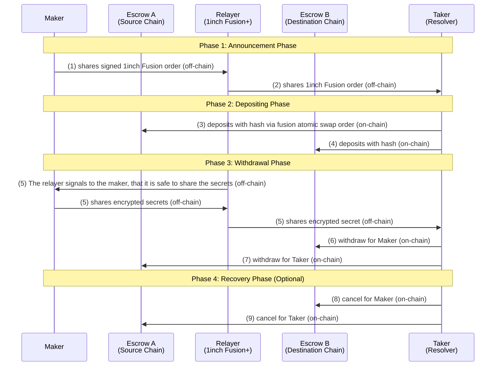

# 🌐 Extend Fusion+ to ICP

This project brings **atomic cross-chain swaps** to the Internet Computer (ICP) by integrating with the existing [1inch Fusion+](https://1inch.io/fusion) infrastructure on Ethereum. It implements a Rust-based HTLC system on ICP that preserves the **hashlock** and **timelock** logic required for atomic execution.

> ❗️This is an MVP prototype for the [ETHGlobal Unite DeFi Hackathon](https://ethglobal.com/events/unite), track: **Extend Fusion+ to ICP**.

---

## Summary

This project addresses the **"Extend Fusion+ to ICP"** challenge by **building a novel extension for 1inch Cross-chain Swap (Fusion+) that enables swaps between Ethereum and ICP**.

---

## Challenge Requirements

### Qualification Requirements (Mandatory)

- [x] **Preserve hashlock and timelock functionality** for the non-EVM implementation
- [x] **Swap functionality should be bidirectional** (swaps should be possible to and from Ethereum)
- [ ] **Onchain (mainnet or testnet) execution** of token transfers should be presented during the final demo

### Stretch Goals (Not Hard Requirements)

- [ ] **UI** - User interface for the swap functionality
- [ ] **Enable partial fills** - Support for partial order execution
- [ ] **Relayer and resolver** - Implementation of relayer and resolver components

---

## Challenge Explained

**Why This Is Needed:**

- Enables atomic swaps between Ethereum and ICP ecosystems
- Extends 1inch Fusion+ to support ICP tokens
- Provides cross-chain liquidity and trading opportunities

**What This Will Allow:**

- Users to swap ETH/ERC-20 tokens for ICP/ICRC-1 tokens
- Seamless integration with existing 1inch infrastructure
- Foundation for more complex cross-chain DeFi applications

---

## Trust Model

Cross-chain systems require users to trust various components. This section explains what users must trust when using our ICP-Ethereum swap system and how we address these trust assumptions.

- **RPC Provider Trust**: Ethereum state is verified via public RPCs (e.g. Infura, Alchemy)
- **HTTP Outcalls**: Executed via Chain Fusion, which requires consensus among subnet nodes
- **Canister Immutability**: Currently mutable (for development); can be locked for production
- **Economic Model**: ICP uses a reverse gas model — developers pay for execution (cycles)

---

## What We Build

### ICP Components (Custom Implementation)

- Rust canister managing HTLC escrows (hashlock + timelock)
- ICRC-1 token integration
- Secret revelation & refund logic
- HTTP outcall logic for Ethereum verification
- Manual resolver CLI for swap orchestration
- Canister timer-based refund execution

### Ethereum Components (Reused Infrastructure)

- Existing 1inch Fusion+ smart contracts (no changes)
- Standard EIP-712 order signatures
- Ethereum testnet (Sepolia) tokens
- Ethereum resolver logic performed manually

---

## Development

### Phase 0 - Understand 1inch Chain Fusion+

- [ ] Read docs
- [ ] Exchange with people
- [ ] Try some code

### Phase 1 - Implement 1inch Limit Order Protocol

Since the Chain Fusion+, builds on the top of Chain Fusio and the Limit Order Protocol, we decided to implement first the Limit Order Protocol on ICP

#### Resources

- Anton Bukov, "Limit Order Protocol presentation" --> https://www.youtube.com/live/DKQJlzJuTqQ?si=uYVrEpZpAcJo0Dtg&t=3252
- 1inch Limit Order Protocol implementation --> https://github.com/1inch/limit-order-protocol

## Architecture - 1inch Fusion Atomic Swaps Flow

## Overview

This document illustrates the complete flow of 1inch Fusion atomic swaps across different entities and phases, showing both off-chain calls and on-chain transactions.

## Participants

- **Maker**: Initiates the swap
- **Escrow A (Source Chain)**: Escrow service on the source blockchain
- **Relayer**: Facilitates communication and order sharing (in our case: 1inch Fusion+)
- **Escrow B (Destination Chain)**: Escrow service on the destination blockchain
- **Taker (Resolver)**: The counterparty completing the swap

## Flow Diagram



## Phase Details

### Phase 1: Announcement Phase

- **Off-chain calls**
- (1) Maker creates and signs a 1inch Fusion order and shares it with the Relayer (1inch infra)
- (2) Order is shared through the relayer to potential takers (resolvers)

### Phase 2: Depositing Phase

- **On-chain transactions**
- (3) Taker deposits assets into source chain escrow with hashlock
- (4) Taker deposits assets into destination chain escrow with same hashlock
- Both escrows are now funded and waiting for secret revelation

### Phase 3: Withdrawal Phase

- **Mixed off-chain and on-chain activity**
- (5) The relayer signals to the maker that it safe to to shares encrypted secrets via relayer
- (5) Maker shares encrypted secrets with the relayer
- (5) The relayer shared the enctypted secret of maker with the taker.
- Atomic swap is completed

### Phase 4: Recovery Phase (Optional)

- **On-chain transactions** (teal arrows in original)
- If timelock expires without completion, either party can cancel
- Assets are returned to their original owners
- Used only if normal withdrawal fails

**Source**: Based on 1inch Fusion+ protocol documentation --> https://help.1inch.io/en/articles/9842591-what-is-1inch-fusion-and-how-does-it-work#h_c2aa86c7b0

---

## Tech Stack

- [ ] **ICP Canister** - Rust + `ic-cdk` + `candid`
- [ ] **Token Support** - ICRC-1 standard
- [ ] **Timers / Refund Logic** - Canister global timer API
- [ ] **Cross-chain Verification** - HTTP outcalls + Ethereum RPC
- [ ] **CLI Resolver Script** - Typescript / Node.js
- [ ] **Ethereum Testnet** - Sepolia + 1inch Fusion+

---

## Testing & Demo Instructions

There is a script test folder with some testing (that will change). Eventually you could find a README in the folder for a correct execution.

### Demo Flow

**TO IMPLEMENT:**

1. **Generate a signed order** on 1inch Fusion+ (Sepolia)
2. **Run manual resolver CLI** to:
   - Monitor and detect matching orders
   - Create ETH escrow via 1inch relayer
   - Deploy ICP escrow and lock ICRC-1 tokens
3. **Reveal secret** to claim both sides
4. **Observe** actual testnet transfers on Etherscan and ICP Dashboard

Demo tokens are pre-distributed to simplify testing.

---

## Limitations

- Manual coordination only (no relayer automation yet)
- Only supports ICRC-1 tokens (e.g. wrapped ICP, test tokens)
- Playground deployment limits (20 min); mainnet deploy preferred

### Architecture Decisions

**Single Canister vs Factory Pattern:**

- MVP uses single canister for simplicity and cost efficiency
- Factory pattern (multiple escrow canisters) considered for production scaling
- Trade-off: Simplicity vs. scalability and deterministic addressing
- Future enhancement: Migrate to factory pattern for production deployment

---

## References

- [Fusion+ Docs](https://docs.1inch.io/docs/fusion/)
- [ICP Canisters](https://internetcomputer.org/docs/current/developer-docs/backend/canister-development)
- [HTLC Overview](https://en.bitcoin.it/wiki/Hash_Time_Locked_Contracts)
- [ICRC-1 Token Standard](https://github.com/dfinity/ICRC-1)

---

## Appendix I: Trust Model Details & Mitigations

### RPC Provider Trust

**Challenge:** Users must trust Ethereum RPC providers (Infura, Alchemy, etc.) to return accurate blockchain state.

**Our Mitigation Strategy:**

- **Multiple Provider Fallback:** Query multiple RPC providers and compare results
- **Consensus Verification:** Only accept responses that match across providers
- **Transparent Provider List:** Public list of all RPC providers used
- **Error Handling:** Clear error messages when providers disagree

**User Transparency:** We clearly document which RPC providers we use and how we handle provider disagreements.

### HTTP Outcalls & Chain Fusion

**Challenge:** ICP's Chain Fusion requires consensus among subnet nodes, which introduces trust in the consensus mechanism.

**Our Mitigation Strategy:**

- **Consensus Documentation:** Clear explanation of how 2/3 consensus works
- **Fallback Mechanisms:** Manual verification options when consensus fails
- **Timeout Handling:** Graceful degradation when outcalls fail
- **User Notifications:** Real-time status of cross-chain verification

**User Transparency:** Users can see the consensus status and have manual fallback options.

### Canister Immutability

**Challenge:** Mutable canisters can be exploited through malicious upgrades.

**Our Mitigation Strategy:**

- **Development Phase:** Mutable canisters for testing and iteration
- **Production Phase:** Immutable deployment (remove all controllers)
- **Clear Phases:** Explicit distinction between development and production
- **Audit Trail:** Public documentation of all canister upgrades

**User Transparency:** Clear indication of canister mutability status and upgrade history.

### Economic Model (Reverse Gas)

**Challenge:** Developers pay for execution, creating potential DoS vulnerabilities.

**Our Mitigation Strategy:**

- **Rate Limiting:** Prevent excessive requests from single users
- **Cycle Monitoring:** Real-time tracking of cycle consumption
- **DoS Protection:** Automatic throttling and blocking mechanisms
- **Cost Transparency:** Public cycle cost estimates for operations

**User Transparency:** Users understand they don't pay fees but should be aware of rate limits.

### Cross-Chain State Consistency

**Challenge:** Ensuring both chains have consistent state during atomic swaps.

**Our Mitigation Strategy:**

- **State Verification:** Cross-chain state checks before execution
- **Rollback Mechanisms:** Ability to revert partial executions
- **Manual Recovery:** Clear procedures for inconsistent states
- **Event Logging:** Comprehensive audit trail of all operations

**User Transparency:** Real-time status updates and clear recovery procedures.

---

## Development Setup

### Prerequisites

- [DFX](https://internetcomputer.org/docs/current/developer-docs/setup/install) - Internet Computer SDK
- [Node.js](https://nodejs.org/) - For frontend development
- [Rust](https://rustup.rs/) - For canister development

### Quick Start

```bash
# Start local replica
dfx start --background

# Deploy canisters
dfx deploy

# Start frontend development server
npm start
```

### Useful Commands

```bash
# Get help with dfx commands
dfx help
dfx canister --help

# Deploy to local replica
dfx deploy

# Deploy to ICP testnet
dfx deploy --network ic

# Generate candid interface
npm run generate

# Check canister status
dfx canister status backend
```

### Running the project locally

If you want to test your project locally, you can use the following commands:

```bash
# Starts the replica, running in the background
dfx start --background

# Deploys your canisters to the replica and generates your candid interface
dfx deploy
```

Once the job completes, your application will be available at `http://localhost:4943?canisterId={asset_canister_id}`.

If you have made changes to your backend canister, you can generate a new candid interface with

```bash
npm run generate
```

at any time. This is recommended before starting the frontend development server, and will be run automatically any time you run `dfx deploy`.

If you are making frontend changes, you can start a development server with

```bash
npm start
```

Which will start a server at `http://localhost:8080`, proxying API requests to the replica at port 4943.

### Note on frontend environment variables

If you are hosting frontend code somewhere without using DFX, you may need to make one of the following adjustments to ensure your project does not fetch the root key in production:

- set`DFX_NETWORK` to `ic` if you are using Webpack
- use your own preferred method to replace `process.env.DFX_NETWORK` in the autogenerated declarations
  - Setting `canisters -> {asset_canister_id} -> declarations -> env_override to a string` in `dfx.json` will replace `process.env.DFX_NETWORK` with the string in the autogenerated declarations
- Write your own `createActor` constructor

For more information, see the [ICP Developer Documentation](https://internetcomputer.org/docs/current/developer-docs/).

---

## 🏁 Final Notes

This project showcases **cross-chain composability** by bridging ICP and Ethereum through existing DeFi infrastructure. It's a foundational step for building more robust relayer systems and privacy-preserving bridges in the future.
