# ICP Fusion+ Implementation - Mechanical Turk Demo

> **Purpose**: Define a minimal working demo to validate Chain Fusion+ ICP ↔ ETH before building the full protocol
> **Strategy**: Start with a working application, then incrementally add Fusion+ features
> **Reference**: [Fusion+ Whitepaper](1inch-fusion-plus-whitepaper.md), [Cross-Chain Communication](icp-fusion-plus-implementation-03-cross-chain-communication.md)

## 🎯 **Core Flow: Receipt-Based Atomic Swaps**

> **✅ External Validation**: This approach has been reviewed and confirmed as **solid for PoC stage** by independent technical review.

### **Setup**

- **Maker**: Frontend user wanting to swap (gasless Web2 experience)
- **Taker/Resolver**: Frontend user providing liquidity (same interface, different role)
- **Relayer**: Infrastructure owner (canisters, contracts, manual coordination)

### **Flow Summary (Both Directions)**

```
1. Order Placement: Maker locks funds in Src Escrow
2. Order Acceptance: Taker/Resolver locks funds in Dst Escrow
3. Manual Verification: Relayer confirms both escrows funded
4. Key Release: Secret given to taker/resolver
5. Receipt-Based Completion:
   ├── Taker/Resolver transfers to maker (gets receipt)
   └── Taker/Resolver claims locked funds (needs receipt + key)
```

### **Why This Works for PoC**

- ✅ **Best-Case Only**: No adversarial behavior, timeouts, or edge cases
- ✅ **Fusion+ Architecture**: Mirrors whitepaper flow without safety mechanisms
- ✅ **Manual Coordination**: Human relayer validates cross-chain state
- ✅ **True Atomicity**: Receipt system ensures both transfers complete
- ✅ **No Economic Model**: No deposits, fees, or competition needed yet

> **📋 Detailed Technical Flow**: Complete step-by-step mechanics documented in [Mechanical Turk Flow](icp-fusion-plus-implementation-04.5-mechanical-turk-flow.md)

## 📋 **Overview**

This document outlines a "Mechanical Turk" approach to building Chain Fusion+ ICP ↔ ETH integration. Instead of implementing the full protocol first, we build a working swap application with manual/automated components, then gradually replace them with proper Fusion+ mechanisms.

### **Core Principle**

```
Build a working swap app first → Add Fusion+ features incrementally
Rather than: Build Fusion+ protocol → Hope it works in practice
```

## 🎯 **Demo Objectives**

### **Primary Goals**

1. **Validate User Experience**: Prove the swap flow works end-to-end
2. **Test Technical Integration**: Verify ICP ↔ ETH communication works
3. **Demonstrate Value Proposition**: Show zero gas fees for users
4. **Establish Development Foundation**: Create base architecture for full implementation

### **Success Criteria**

- User can swap ICP for ETH through Web2-style interface
- User pays zero gas fees
- Swap completes atomically (succeeds completely or fails completely)
- Technical stack supports future Fusion+ enhancements

## 🏗️ **Architecture Overview**

### **Component Stack**

```
┌─────────────────────────────────────┐
│           Web2 Frontend             │ ← User sees familiar interface
├─────────────────────────────────────┤
│         MetaMask Integration        │ ← Standard Web3 connection
├─────────────────────────────────────┤
│       Centralized Resolver API      │ ← "Mechanical Turk" component
├─────────────────────────────────────┤
│    ICP Canister    │  ETH Contract  │ ← Actual blockchain integration
└─────────────────────────────────────┘
```

### **Data Flow**

```mermaid
graph TD
    subgraph "ICP → ETH Swap"
        A1[User: Sign ICP Transfer] --> B1[Relayer: Verify Signature]
        B1 --> C1[User: Share Password]
        C1 --> D1[Resolver: Send ETH to User]
        D1 --> E1[Complete: ICP→Resolver, ETH→User]
    end

    subgraph "ETH → ICP Swap"
        A2[User: Sign EIP-712 with MetaMask] --> B2[Resolver: Verify Order]
        B2 --> C2[User: Share Password]
        C2 --> D2[Resolver: Send ICP to User]
        D2 --> E2[Complete: ETH→Resolver, ICP→User]
    end

    subgraph "Single Resolver"
        R[Resolver<br/>ICP Principal + ETH Address<br/>Always Wins Auction]
    end

    A1 -.-> R
    A2 -.-> R
```



## 🛠️ **Technical Implementation Overview**

> **📖 Complete Code Implementation**: All detailed code examples, dependencies, and implementation details can be found in [Mechanical Turk Code Examples](icp-fusion-plus-implementation-05-mechanical-turk-code.md)

The Mechanical Turk demo consists of four main components that work together to provide a seamless ICP ↔ ETH swap experience:

### **Architecture Summary**

| Component           | Technology            | Purpose                          | Complexity |
| ------------------- | --------------------- | -------------------------------- | ---------- |
| **Frontend**        | JavaScript + MetaMask | User interface and order signing | Simple     |
| **Resolver**        | Node.js + Express     | Cross-chain coordination         | Complex    |
| **ICP Integration** | Rust canister         | ICP token management             | Moderate   |
| **ETH Integration** | Solidity contract     | ETH token management             | Simple     |

### **1. Web Frontend (User Interface Layer)**

> **Purpose**: ICP-hosted web interface with SIWE authentication and threshold ECDSA signing
> **Technology**: JavaScript frontend on ICP with MetaMask + SIWE + Chain-Key Cryptography
> **Key Innovation**: Unified ECDSA signing for both directions using ICP's threshold signatures

#### **Corrected Architecture: Unified ECDSA Approach**

**Technical Reality Check:**

- ✅ **SIWE creates valid ICP principals** - deterministically derived from Ethereum address
- ❌ **Ethereum cannot verify ICP-native signatures** - requires ECDSA compatibility
- ✅ **ICP supports threshold ECDSA** - can sign Ethereum-compatible transactions
- ✅ **SIWE principals work for dapp authentication** - valid for canister interactions

#### **Proper Technical Flow**

1. **SIWE Authentication**: User logs in with MetaMask, creates deterministic ICP principal
2. **Cross-Chain Identity**: Single user has both Ethereum address AND ICP principal
3. **Unified Signing**: All transactions use threshold ECDSA (compatible with both chains)
4. **Cross-Chain Execution**: ICP canisters can sign Ethereum transactions directly

#### **Both Swap Directions Use Same Pattern**

**ICP → ETH Swaps:**

- User authenticates via SIWE (session only)
- ICP canister uses threshold ECDSA to sign Ethereum-compatible transaction
- No MetaMask popup needed - canister handles signing

**ETH → ICP Swaps:**

- User authenticates via SIWE (session only)
- User signs EIP-712 order with MetaMask
- Standard Web3 signature verification

#### **Why This Approach Works**

- **True Cross-Chain Identity**: SIWE creates deterministic ICP principal from Ethereum address
- **Technically Sound**: Based on ICP's proven chain-key cryptography
- **Consistent**: ECDSA signatures work on both chains
- **Secure**: Leverages threshold cryptography for cross-chain signing
- **Simple**: Single signature verification system
- **Valid Principals**: SIWE principals are fully functional for canister interactions

> **Key Insight**: SIWE doesn't just create "sessions" - it creates **real ICP principals** that are deterministically derived from your Ethereum address. This means one login gives you both identities!

### **2. Centralized Resolver (Core Orchestration Layer)**

> **Purpose**: Acts as an automated market maker and cross-chain coordinator
> **Technology**: Node.js/Express API with ethers.js and DFINITY agent
> **Role**: Replaces the complex Fusion+ resolver network with a single centralized service

#### **Key Responsibilities**

- **Market Making**: Provides liquidity for ICP ↔ ETH swaps
- **Cross-Chain Coordination**: Manages operations on both ICP and Ethereum
- **Signature Verification**: Validates user intent through EIP-712 signatures
- **Risk Management**: Checks liquidity and validates transactions
- **Transaction Execution**: Orchestrates atomic swaps between chains

#### **Core Libraries Used**

- **`ethers.js`**: Ethereum blockchain interaction and signature verification
- **`@dfinity/agent`**: ICP canister communication
- **`express.js`**: Web server framework for API endpoints
- **`@dfinity/principal`**: ICP identity management

#### **Atomic Swap Process**

1. **Signature Validation**: Verify user actually signed the order
2. **Liquidity Check**: Ensure sufficient reserves for the swap
3. **ICP Locking**: Lock user's ICP tokens on ICP network
4. **ETH Transfer**: Send ETH to user (resolver pays gas fees)
5. **ICP Claiming**: Complete swap by claiming locked ICP
6. **State Updates**: Update internal liquidity tracking

#### **Critical Risk Management**

- **Signature Validation**: Prevents unauthorized transactions
- **Liquidity Checks**: Ensures swaps can be completed
- **Atomic Operations**: All-or-nothing transaction execution
- **Error Recovery**: Handles partial failure scenarios
- **Transaction Logging**: Complete audit trail for debugging

### **3. ICP Integration (Blockchain Backend)**

> **Purpose**: Rust canister that manages ICP token locking and claiming
> **Technology**: IC CDK with Rust, ICP Ledger integration
> **Role**: Handles the ICP side of cross-chain atomic swaps

#### **Core Responsibilities**

- **Token Custody**: Safely hold user ICP tokens during swaps
- **Access Control**: Only authorized resolvers can claim tokens
- **State Tracking**: Maintain records of locked amounts by order
- **Balance Management**: Verify user funds before locking

#### **Key Functions**

- **Token Locking**: Accept and secure user ICP for specific orders
- **Token Release**: Transfer locked ICP to authorized resolvers
- **Authorization Management**: Maintain whitelist of trusted resolvers
- **Balance Verification**: Ensure sufficient funds before operations

#### **Security Model**

- **Multi-step Process**: Separate lock and claim operations
- **Resolver Whitelisting**: Only pre-approved resolvers can claim
- **Balance Validation**: Prevent over-spending and double-claiming
- **Audit Trail**: Complete transaction logging

### **4. ETH Integration (Blockchain Backend)**

> **Purpose**: Solidity contract that manages ETH deposits and distributions
> **Technology**: Solidity smart contract on Ethereum
> **Role**: Handles the ETH side of cross-chain atomic swaps

#### **Core Responsibilities**

- **ETH Custody**: Hold resolver ETH deposits for swap liquidity
- **Distribution Management**: Send ETH to users completing swaps
- **Access Control**: Restrict operations to authorized resolvers
- **Reserve Tracking**: Monitor contract ETH balance

#### **Key Functions**

- **ETH Deposits**: Accept ETH from resolvers for liquidity
- **ETH Transfers**: Send ETH to users completing swaps
- **Resolver Management**: Add/remove authorized resolvers
- **Balance Queries**: Check available liquidity

#### **Security Model**

- **Role-based Access**: Only whitelisted resolvers can operate
- **Balance Protection**: Prevent over-spending contract funds
- **Owner Controls**: Admin manages resolver permissions
- **Emergency Functions**: Safeguards for unexpected situations

## 🚀 **Next Steps**

1. **Build Phase 1 Demo**: Basic working swap application
2. **User Testing**: Validate UX with real users
3. **Technical Iteration**: Fix issues and improve performance
4. **Gradual Enhancement**: Add Fusion+ features incrementally
5. **Production Readiness**: Scale and secure for mainnet deployment

## 📝 **Conclusion**

The Mechanical Turk approach provides a practical path to building Chain Fusion+ ICP ↔ ETH integration. By starting with a working application and incrementally adding complexity, we can:

- Validate technical feasibility early
- Iterate on user experience quickly
- Build confidence in the approach
- Create a solid foundation for full Fusion+ implementation

This strategy reduces risk while maintaining momentum toward the full vision of decentralized, auction-based cross-chain swaps.
