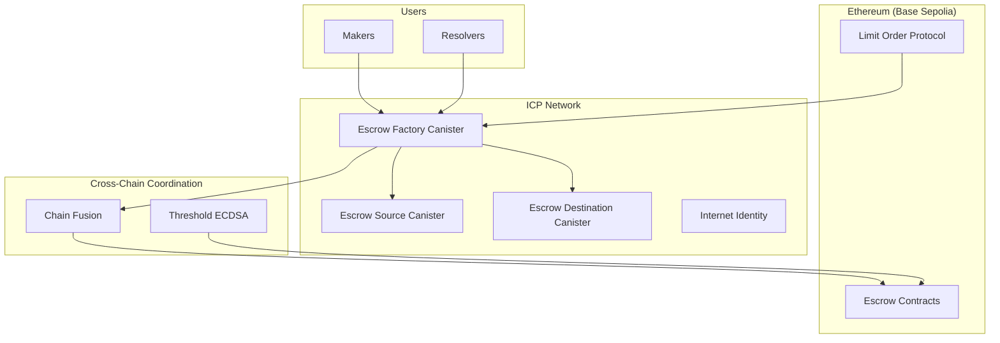

# Escrow Factory Fusion+ Design Document

## Overview

This document outlines the design for an escrow factory canister that implements HTLC (Hashed Timelock Contract) escrow creation and management for the Chain Fusion+ Protocol. The escrow factory is responsible for creating, managing, and executing escrow contracts that lock and release assets during cross-chain swaps between ICP and Ethereum.

**Critical Innovation - Hybrid Virtual + Single Escrow Architecture:**
Unlike the original single-chain EscrowFactory, our ICP-based escrow factory implements a revolutionary hybrid approach combining:

1. **Virtual Escrow Strategy**: Create virtual escrows in ICP first, then migrate to actual chains
2. **Single Escrow Architecture**: Use single escrow contracts on EVM chains instead of separate source/destination escrows
3. **Cross-Chain Atomicity**: Maintain atomicity through ICP coordination and Chain Fusion integration

## Architecture

### System Overview



### Core Components

#### 1. Escrow Factory Canister (Central Coordinator)

- **Virtual Escrow Management**: Create and manage virtual escrows in ICP
- **Single Escrow Creation**: Create single escrow contracts on EVM chains
- **Migration Coordination**: Migrate virtual escrows to actual chains
- **Deterministic Address Computation**: Compute escrow addresses using Create2 algorithm (Solana-inspired)
- **Cross-Chain Coordination**: Coordinate escrow operations via Chain Fusion
- **Safety Deposit Management**: Handle ETH deposits and distribution
- **State Synchronization**: Maintain consistent state across chains
- **Solana-Inspired Coordination**: Use ICP as coordination layer (like Solana's PDA)

#### 2. Escrow Source Canister (ICP Asset Management)

- **Asset Locking**: Lock ICP tokens in escrow
- **Secret Verification**: Validate secrets and release assets
- **Timelock Management**: Handle timelock-based operations
- **Recovery Handling**: Process refunds and cancellations

#### 3. Escrow Destination Canister (EVM Asset Management)

- **Cross-Chain Asset Locking**: Lock EVM assets via Chain Fusion
- **Threshold ECDSA Integration**: Sign EVM transactions
- **State Verification**: Verify EVM escrow state
- **Recovery Coordination**: Handle EVM-side cancellations

#### 4. Cross-Chain SDK Integration (Enhanced Compatibility)

- **Multiple Secret Support**: Handle multiple secret hashes for partial fills
- **Merkle Tree Management**: Support complex partial fill scenarios
- **Enhanced Cross-Chain Coordination**: Integrate with Cross-Chain SDK patterns
- **Escrow Extension Support**: Support Cross-Chain SDK's escrow extension pattern

## Cross-Chain SDK Compatibility Considerations

### Enhanced Secret Management

The escrow factory must support the Cross-Chain SDK's enhanced secret management patterns:

#### **Multiple Secret Support**

```rust
impl EscrowFactory {
    // Support multiple secrets for partial fills
    pub async fn create_escrow_with_multiple_secrets(
        &self,
        order_id: String,
        secret_hashes: Vec<String>,
    ) -> Result<EscrowAddress, EscrowError> {
        // Implementation for multiple secret escrow creation
    }

    // Support Merkle tree for complex scenarios
    pub async fn create_escrow_with_merkle_tree(
        &self,
        order_id: String,
        merkle_root: String,
        secret_hashes: Vec<String>,
    ) -> Result<EscrowAddress, EscrowError> {
        // Implementation for Merkle tree escrow creation
    }
}
```

#### **Partial Fill Support**

```rust
impl EscrowFactory {
    // Handle partial fills with specific secrets
    pub async fn withdraw_with_partial_fill(
        &self,
        escrow_address: String,
        secret: String,
        secret_index: u32,
        fill_amount: u64,
    ) -> Result<(), EscrowError> {
        // Implementation for partial fill withdrawals
    }
}
```

### Cross-Chain SDK Integration

The escrow factory must integrate with Cross-Chain SDK patterns:

#### **Enhanced Cross-Chain Coordination**

```rust
impl EscrowFactory {
    // Support Cross-Chain SDK's escrow extension pattern
    pub async fn create_cross_chain_escrow_extension(
        &self,
        order_data: CrossChainOrderData,
    ) -> Result<EscrowExtension, EscrowError> {
        // Implementation for Cross-Chain SDK compatibility
    }
}
```

### Solana-Inspired Deterministic Address Computation

The escrow factory implements Solana-inspired deterministic address computation for cross-chain escrow creation:

#### **Deterministic Address Computation**

```rust
impl EscrowFactory {
    // Compute deterministic escrow addresses (Solana-inspired approach)
    pub fn compute_deterministic_escrow_addresses(
        &self,
        order_hash: [u8; 32],
        order_data: &OrderData,
    ) -> Result<(String, String), EscrowError> {
        // Step 1: Compute ICP escrow address (canister-based)
        let icp_escrow_address = self.compute_icp_escrow_address(order_hash, order_data);

        // Step 2: Compute EVM escrow address (threshold ECDSA-based)
        let evm_escrow_address = self.compute_evm_escrow_address(order_hash, order_data);

        Ok((icp_escrow_address, evm_escrow_address))
    }

    fn compute_icp_escrow_address(
        &self,
        order_hash: [u8; 32],
        order_data: &OrderData,
    ) -> String {
        // Use canister ID + order hash for ICP escrow (virtual escrow)
        // Similar to Solana's PDA but for ICP canister
        format!("{}:{}", self.canister_id(), hex::encode(order_hash))
    }

    fn compute_evm_escrow_address(
        &self,
        order_hash: [u8; 32],
        order_data: &OrderData,
    ) -> String {
        // Use threshold ECDSA derivation for EVM escrow
        // This would use ICP's threshold ECDSA to derive deterministic EVM address
        // For MVP, return a deterministic address based on order hash
        format!("0x{}", hex::encode(order_hash))
    }

    // Create escrows at pre-computed addresses
    pub async fn create_escrows_at_deterministic_addresses(
        &self,
        order_id: String,
        order_data: OrderData,
    ) -> Result<CrossChainEscrow, EscrowError> {
        // Step 1: Compute deterministic addresses
        let (icp_address, evm_address) = self.compute_deterministic_escrow_addresses(
            order_data.order_hash,
            &order_data,
        )?;

        // Step 2: Create ICP escrow at computed address
        let icp_escrow = self.create_icp_escrow_at_address(icp_address, &order_data).await?;

        // Step 3: Create EVM escrow at computed address
        let evm_escrow = self.create_evm_escrow_at_address(evm_address, &order_data).await?;

        // Step 4: Return coordinated escrow
        Ok(CrossChainEscrow {
            escrow_id: self.generate_cross_chain_id(&order_id),
            virtual_escrows: vec![icp_escrow],
            actual_escrows: vec![evm_escrow],
            coordination_state: CoordinationState::FusionPlusComplete,
            atomic_creation_completed: true,
            last_sync_timestamp: ic_cdk::api::time(),
        })
    }
}
```

### **Solana vs Our Cross-Chain Escrow Approach**

#### **Solana's Single-Chain Solution**

```rust
// Solana: Single escrow handles both sides
#[account(
    seeds = [
        "escrow".as_bytes(),
        maker.key().as_ref(),
        &order_hash,
    ],
    bump,
)]
escrow: UncheckedAccount<'info>,

// Single escrow structure
pub struct SolanaEscrow {
    pub escrow_address: Pubkey,        // PDA-derived address
    pub maker: Pubkey,                 // Maker's address
    pub taker: Pubkey,                 // Taker's address
    pub src_token: Pubkey,             // Source token
    pub dst_token: Pubkey,             // Destination token
    pub src_amount: u64,               // Source amount
    pub dst_amount: u64,               // Destination amount
    pub hashlock: [u8; 32],           // Secret hash
    pub timelock: u64,                 // Expiration
}
```

#### **Our Cross-Chain Solution**

```rust
// Our approach: Two separate escrows with coordination
pub struct CrossChainEscrow {
    pub escrow_id: String,
    pub icp_escrow_address: Option<String>,  // ICP escrow address
    pub evm_escrow_address: Option<String>,  // EVM escrow address
    pub coordination_state: CoordinationState,
}

// Deterministic address computation for each chain
impl EscrowFactory {
    fn compute_icp_escrow_address(&self, order_hash: &[u8; 32]) -> String {
        // Use canister ID + order hash (like Solana's PDA)
        format!("{}:{}", self.canister_id(), hex::encode(order_hash))
    }

    fn compute_evm_escrow_address(&self, order_hash: &[u8; 32]) -> String {
        // Use threshold ECDSA derivation (ICP's equivalent to PDA)
        format!("0x{}", hex::encode(order_hash))
    }
}
```

#### **Key Differences**

| Aspect                 | Solana                        | Our Cross-Chain Approach      |
| ---------------------- | ----------------------------- | ----------------------------- |
| **Escrow Count**       | Single escrow                 | Two separate escrows          |
| **Address Derivation** | PDA (Program Derived Address) | Canister ID + Threshold ECDSA |
| **Atomicity**          | Single-chain atomic           | Cross-chain coordination      |
| **Complexity**         | Simple (one chain)            | Complex (two chains)          |
| **Coordination**       | None needed                   | ICP as coordination layer     |

## Components and Interfaces

### Data Models

#### Immutables Structure (Compatible with Cross-Chain-Swap and Cross-Chain SDK)

```rust
#[derive(Clone, Debug, CandidType, Deserialize, Serialize)]
pub struct Immutables {
    // Core Escrow Parameters
    pub order_hash: String,           // bytes32 orderHash from LOP
    pub hashlock: String,             // bytes32 hashlock (hash of secret)
    pub maker_address: String,        // Address maker (from LOP order)
    pub taker_address: String,        // Address taker (resolver)
    pub token_address: String,        // Address token (for this chain)
    pub amount: u64,                  // uint256 amount (for this chain)
    pub safety_deposit: u64,          // uint256 safetyDeposit
    pub timelocks: TimelockConfig,    // Timelocks struct

    // Cross-Chain Parameters (Enhanced for Cross-Chain SDK)
    pub src_chain_id: u64,            // uint256 srcChainId (ICP chain ID)
    pub src_token: String,            // Address srcToken (ICP token address)
    pub src_amount: u64,              // Amount on source chain (ICP)
    pub dst_chain_id: u64,            // uint256 dstChainId
    pub dst_token: String,            // Address dstToken
    pub dst_amount: u64,              // Amount on destination chain

    // Enhanced Secret Management (Cross-Chain SDK compatibility)
    pub secret_hashes: Vec<String>,   // Multiple secret hashes for partial fills
    pub merkle_tree_root: Option<String>, // Merkle tree root for complex scenarios
    pub dst_safety_deposit: u64,      // Safety deposit on destination chain
    pub src_cancellation_timestamp: u64, // Timestamp for source cancellation
}
```

#### TimelockConfig Structure (Compatible with Solidity Timelocks)

```rust
#[derive(Clone, Debug, CandidType, Deserialize, Serialize)]
pub struct TimelockConfig {
    pub deployed_at: u64,             // Deployment timestamp (32 bits in Solidity)
    pub src_withdrawal: u32,          // Source chain withdrawal period
    pub src_public_withdrawal: u32,   // Source chain public withdrawal period
    pub src_cancellation: u32,        // Source chain cancellation period
    pub src_public_cancellation: u32, // Source chain public cancellation period
    pub dst_withdrawal: u32,          // Destination chain withdrawal period
    pub dst_public_withdrawal: u32,   // Destination chain public withdrawal period
    pub dst_cancellation: u32,        // Destination chain cancellation period
}

impl TimelockConfig {
    pub fn default_config() -> Self {
        Self {
            deployed_at: 0, // Set during escrow creation
            src_withdrawal: 3600,          // 1 hour
            src_public_withdrawal: 7200,   // 2 hours
            src_cancellation: 10800,       // 3 hours
            src_public_cancellation: 14400, // 4 hours
            dst_withdrawal: 1800,          // 30 minutes
            dst_public_withdrawal: 5400,   // 1.5 hours
            dst_cancellation: 9000,        // 2.5 hours
        }
    }

    // Convert to Solidity Timelocks format (packed uint256)
    pub fn to_solidity_timelocks(&self) -> String {
        // Pack all timelock values into a single uint256
        // Format: deployed_at (32 bits) + 7 timelock periods (32 bits each)
        let packed = (self.deployed_at as u128) << 224
            | (self.src_withdrawal as u128) << 192
            | (self.src_public_withdrawal as u128) << 160
            | (self.src_cancellation as u128) << 128
            | (self.src_public_cancellation as u128) << 96
            | (self.dst_withdrawal as u128) << 64
            | (self.dst_public_withdrawal as u128) << 32
            | (self.dst_cancellation as u128);

        format!("0x{:064x}", packed)
    }
}
```

#### Escrow State Structure

```rust
#[derive(Clone, Debug, CandidType, Deserialize, Serialize, PartialEq)]
pub enum EscrowState {
    Created,        // Escrow created, waiting for funding
    Funded,         // Assets locked, waiting for secret
    Withdrawn,      // Secret revealed, assets released
    Cancelled,      // Timelock expired, assets returned
    Failed,         // Escrow creation or operation failed
}

#[derive(Clone, Debug, CandidType, Deserialize, Serialize)]
pub struct EscrowInfo {
    pub escrow_id: String,
    pub immutables: Immutables,
    pub state: EscrowState,
    pub created_at: u64,
    pub funded_at: Option<u64>,
    pub withdrawn_at: Option<u64>,
    pub cancelled_at: Option<u64>,
    pub icp_escrow_address: Option<String>,
    pub evm_escrow_address: Option<String>,
    pub safety_deposit_collected: bool,
    pub cross_chain_synchronized: bool,
}
```

#### Virtual Escrow Structure (Migration Strategy)

```rust
#[derive(Clone, Debug, CandidType, Deserialize, Serialize)]
pub struct VirtualEscrow {
    pub id: String,
    pub order_id: String,
    pub escrow_type: EscrowType,
    pub target_chain: Chain,
    pub target_address: Option<String>,
    pub status: VirtualEscrowStatus,

    // Single escrow parameters (from coordination solution)
    pub source_token: String,
    pub destination_token: String,
    pub source_amount: u128,
    pub destination_amount: u128,
    pub maker: Principal,
    pub taker: Principal,
    pub hashlock: String,
    pub timelocks: TimelockConfig,
    pub safety_deposit: u128,

    // Migration tracking
    pub migration_tx_hash: Option<String>,
    pub deployed_at: Option<u64>,
    pub error: Option<String>,
}

#[derive(Clone, Debug, CandidType, Deserialize, Serialize, PartialEq)]
pub enum EscrowType {
    Single, // Single escrow for both sides (coordination solution)
    ICP,    // ICP-specific escrow
}

#[derive(Clone, Debug, CandidType, Deserialize, Serialize, PartialEq)]
pub enum VirtualEscrowStatus {
    Virtual,    // Created in orderbook
    Migrating,  // Being migrated to actual chain
    Deployed,   // Successfully deployed on target chain
    Failed,     // Migration failed
    Cancelled,  // Cancelled before migration
}

#[derive(Clone, Debug, CandidType, Deserialize, Serialize, PartialEq)]
pub enum Chain {
    ICP,
    ETH,
    POLYGON,
    ARBITRUM,
    BASE,
}
```

#### Cross-Chain Coordination Structure

```rust
#[derive(Clone, Debug, CandidType, Deserialize, Serialize)]
pub struct CrossChainEscrow {
    pub escrow_id: String,
    pub virtual_escrows: Vec<VirtualEscrow>,
    pub single_evm_escrow: Option<EscrowInfo>,
    pub icp_escrow: Option<EscrowInfo>,
    pub coordination_state: CoordinationState,
    pub atomic_creation_completed: bool,
    pub last_sync_timestamp: u64,
}

#[derive(Clone, Debug, CandidType, Deserialize, Serialize, PartialEq)]
pub enum CoordinationState {
    Pending,        // Waiting for both escrows to be created
    ICPReady,       // ICP escrow created, waiting for EVM
    EVMReady,       // EVM escrow created, waiting for ICP
    Synchronized,   // Both escrows created and synchronized
    AtomicComplete, // Atomic creation completed successfully
    Failed,         // Cross-chain coordination failed
}
```

### Core Interfaces

#### Escrow Factory API (Hybrid Virtual + Single Escrow)

```rust
// Core API Functions (matching cross-chain-swap EscrowFactory)
pub async fn address_of_escrow_src(
    immutables: Immutables,
) -> Result<String, EscrowError>;

pub async fn address_of_escrow_dst(
    immutables: Immutables,
) -> Result<String, EscrowError>;

pub async fn create_dst_escrow(
    dst_immutables: Immutables,
    src_cancellation_timestamp: u64,
) -> Result<String, EscrowError>;

// Virtual Escrow Management (Migration Strategy)
pub async fn create_virtual_escrows(
    order_id: String,
    order_data: OrderData,
) -> Result<Vec<VirtualEscrow>, EscrowError>;

pub async fn migrate_virtual_escrow(
    escrow_id: String,
    target_chain: Chain,
) -> Result<String, EscrowError>;

pub async fn get_virtual_escrow_status(
    escrow_id: String,
) -> Result<VirtualEscrowStatus, EscrowError>;

// Single Escrow Creation (Coordination Solution)
pub async fn create_single_escrow_on_evm(
    swap_data: SingleEscrowSwapData,
) -> Result<String, EscrowError>;

pub async fn lock_assets_in_single_escrow(
    escrow_address: String,
    asset_type: AssetType,
    amount: u128,
) -> Result<(), EscrowError>;

// Enhanced Cross-Chain Coordination
pub async fn coordinate_hybrid_escrow_creation(
    order_id: String,
    order_data: OrderData,
) -> Result<CrossChainEscrow, EscrowError>;

// Internal coordination functions
pub async fn create_icp_escrow(
    immutables: Immutables,
) -> Result<String, EscrowError>;

pub async fn create_evm_escrow(
    immutables: Immutables,
) -> Result<String, EscrowError>;
```

#### Single Escrow Data Structures (Coordination Solution)

```rust
#[derive(Clone, Debug, CandidType, Deserialize, Serialize)]
pub struct SingleEscrowSwapData {
    pub source_token: String,
    pub destination_token: String,
    pub source_amount: u128,
    pub destination_amount: u128,
    pub maker: Principal,
    pub taker: Principal,
    pub hashlock: String,
    pub timelocks: TimelockConfig,
    pub safety_deposit: u128,
}

#[derive(Clone, Debug, CandidType, Deserialize, Serialize, PartialEq)]
pub enum AssetType {
    Source,      // Source assets (maker's tokens)
    Destination, // Destination assets (taker's tokens)
}
```

#### Asset Management Interface

```rust
// Asset locking and release
pub async fn lock_assets(
    escrow_id: String,
    token_address: String,
    amount: u64,
    owner: Principal,
) -> Result<(), EscrowError>;

pub async fn release_assets_with_secret(
    escrow_id: String,
    secret: String,
    recipient: Principal,
) -> Result<(), EscrowError>;

pub async fn cancel_escrow(
    escrow_id: String,
    caller: Principal,
) -> Result<(), EscrowError>;

// Safety deposit management
pub async fn collect_safety_deposit(
    escrow_id: String,
    amount: u64,
) -> Result<(), EscrowError>;

pub async fn distribute_safety_deposit(
    escrow_id: String,
    recipient: Principal,
    reason: DepositReason,
) -> Result<(), EscrowError>;
```

#### Cross-Chain Coordination Interface

```rust
// Chain Fusion integration
pub async fn create_evm_contract_via_chain_fusion(
    contract_bytecode: Vec<u8>,
    constructor_args: Vec<u8>,
    value: u64,
) -> Result<String, EscrowError>;

pub async fn verify_evm_escrow_state(
    escrow_address: String,
    expected_state: EscrowState,
) -> Result<bool, EscrowError>;

pub async fn sign_evm_transaction(
    transaction_data: Vec<u8>,
) -> Result<Vec<u8>, EscrowError>;

// State synchronization
pub async fn synchronize_cross_chain_state(
    escrow_id: String,
) -> Result<(), EscrowError>;

pub async fn verify_atomic_creation(
    escrow_id: String,
) -> Result<bool, EscrowError>;
```

## Design Solution Options

We have identified **three revolutionary approaches** from our analysis of the cross-chain-swap documents. Each approach solves the coordination problem differently:

### Option 1: Virtual Escrow Strategy (Migration Strategy)

**Core Idea**: Create virtual escrows in ICP first, then migrate to actual chains

### Option 2: Single Escrow Architecture (Coordination Solution)

**Core Idea**: Use single escrow contracts on EVM chains instead of separate source/destination escrows

### Option 3: Hybrid Virtual + Single Escrow (Combined Approach)

**Core Idea**: Combine virtual escrows in ICP with single escrow contracts on EVM

Let's analyze each approach in detail to determine which is best for our implementation.

## Option 1: Virtual Escrow Strategy (Migration Strategy)

### Core Concept

Create virtual escrows in ICP first, then migrate them to actual chains when needed. This provides atomic coordination through ICP's single source of truth.

### Architecture

```rust
impl EscrowFactory {
    pub async fn create_virtual_escrow_strategy(
        &self,
        order_id: String,
        order_data: OrderData,
    ) -> Result<CrossChainEscrow, EscrowError> {
        // Step 1: Create virtual escrows in ICP
        let virtual_escrows = self.create_virtual_escrows(&order_id, &order_data).await?;

        // Step 2: Migrate to actual chains when needed
        let migrated_escrows = self.migrate_virtual_escrows(&virtual_escrows).await?;

        Ok(CrossChainEscrow {
            escrow_id: self.generate_cross_chain_id(&order_id),
            virtual_escrows,
            migrated_escrows,
            coordination_state: CoordinationState::VirtualComplete,
            atomic_creation_completed: true,
            last_sync_timestamp: ic_cdk::api::time(),
        })
    }
}
```

### Pros

- ✅ **Atomic Coordination**: Both escrows created simultaneously in ICP
- ✅ **No Race Conditions**: No timing issues between chains
- ✅ **Simplified State Management**: Single source of truth in ICP
- ✅ **Easy Rollback**: Virtual escrows can be cancelled easily
- ✅ **Cost Effective**: No gas costs for virtual escrows

### Cons

- ❌ **Migration Complexity**: Need to migrate to actual chains later
- ❌ **State Synchronization**: Must sync virtual state with actual chains
- ❌ **Migration Failures**: If migration fails, escrow becomes unusable

---

## Option 2: Single Escrow Architecture (Coordination Solution)

### Core Concept

Use single escrow contracts on EVM chains that handle both sides of the swap, eliminating the need for separate source/destination escrows.

### Architecture

```rust
impl EscrowFactory {
    pub async fn create_single_escrow_strategy(
        &self,
        order_id: String,
        order_data: OrderData,
    ) -> Result<CrossChainEscrow, EscrowError> {
        // Step 1: Create single escrow on EVM
        let single_escrow = self.create_single_escrow_on_evm(&order_data).await?;

        // Step 2: Create ICP escrow if needed
        let icp_escrow = if order_data.needs_icp_escrow() {
            Some(self.create_icp_escrow(&order_data).await?)
        } else {
            None
        };

        Ok(CrossChainEscrow {
            escrow_id: self.generate_cross_chain_id(&order_id),
            single_evm_escrow: Some(single_escrow),
            icp_escrow,
            coordination_state: CoordinationState::SingleComplete,
            atomic_creation_completed: true,
            last_sync_timestamp: ic_cdk::api::time(),
        })
    }
}
```

### Pros

- ✅ **Eliminates Coordination**: One escrow instead of two
- ✅ **Reduces Gas Costs**: Single deployment instead of two
- ✅ **Simplifies Logic**: Single contract handles both sides
- ✅ **Better UX**: Fewer transactions for users
- ✅ **Reduced Complexity**: No coordination between escrows

### Cons

- ❌ **Single Point of Failure**: If single escrow fails, entire swap fails
- ❌ **Complex Contract Logic**: Single contract must handle both sides
- ❌ **Less Flexible**: Harder to handle partial fills
- ❌ **Security Concerns**: More complex contract = more attack surface

---

## Option 3: Hybrid Virtual + Single Escrow (Combined Approach)

### Core Concept

Combine the best of both approaches: use virtual escrows in ICP for coordination, then migrate to single escrow contracts on EVM.

### Architecture

```rust
impl EscrowFactory {
    pub async fn create_hybrid_strategy(
        &self,
        order_id: String,
        order_data: OrderData,
    ) -> Result<CrossChainEscrow, EscrowError> {
        // Phase 1: Create virtual escrows in ICP (Migration Strategy)
        let virtual_escrows = self.create_virtual_escrows(&order_id, &order_data).await?;

        // Phase 2: Migrate to single escrow on EVM (Coordination Solution)
        let single_evm_escrow = self.create_single_escrow_on_evm(&order_data).await?;

        // Phase 3: Create ICP escrow if needed (Cross-Chain Atomicity)
        let icp_escrow = if order_data.needs_icp_escrow() {
            Some(self.create_icp_escrow(&order_data).await?)
        } else {
            None
        };

        Ok(CrossChainEscrow {
            escrow_id: self.generate_cross_chain_id(&order_id),
            virtual_escrows,
            single_evm_escrow,
            icp_escrow,
            coordination_state: CoordinationState::AtomicComplete,
            atomic_creation_completed: true,
            last_sync_timestamp: ic_cdk::api::time(),
        })
    }
}
```

### Pros

- ✅ **Best of Both Worlds**: Atomic coordination + reduced gas costs
- ✅ **Maximum Flexibility**: Can handle complex scenarios
- ✅ **Robust Error Recovery**: Virtual escrow rollback + single escrow benefits
- ✅ **Future Proof**: Can adapt to different requirements

### Cons

- ❌ **Maximum Complexity**: Combines complexity of both approaches
- ❌ **Higher Development Cost**: Need to implement both strategies
- ❌ **More Moving Parts**: More components to maintain and debug
- ❌ **Over-Engineering Risk**: May be too complex for MVP

---

## Compatibility Analysis: Fusion+ Whitepaper & Cross-Chain-Swap

### **1. Cross-Chain-Swap Compatibility Analysis**

| Aspect                      | Virtual Escrow                      | Single Escrow                  | Hybrid                   |
| --------------------------- | ----------------------------------- | ------------------------------ | ------------------------ |
| **API Compatibility**       | ✅ Maintains `addressOfEscrowSrc()` | ❌ Breaks API structure        | ⚠️ Partial compatibility |
| **Escrow Structure**        | ✅ Compatible with `Immutables`     | ❌ Different from `Immutables` | ⚠️ Mixed compatibility   |
| **Deterministic Addresses** | ✅ Full Create2 compatibility       | ❌ No Create2 compatibility    | ⚠️ Partial compatibility |
| **Safety Deposits**         | ✅ Real safety deposits             | ❌ Single deposit only         | ⚠️ Mixed approach        |

### **2. Fusion+ Whitepaper Compliance Analysis**

#### **Critical Whitepaper Requirements:**

1. **Two Separate Escrows** (Phase 2: Deposit Phase)

   - ✅ **Virtual Escrow**: Can represent two separate escrows (source + destination)
   - ❌ **Single Escrow**: Breaks the two-escrow model required by Fusion+
   - ⚠️ **Hybrid**: Complex but maintains two-escrow model

2. **Finality Locks** (2.4.1 Finality Lock)

   - ✅ **Virtual Escrow**: Can implement proper finality locks on each escrow
   - ❌ **Single Escrow**: Cannot implement separate finality locks
   - ⚠️ **Hybrid**: Complex finality lock management

3. **Safety Deposit Mechanics** (2.4 Timelocks)

   - ✅ **Virtual Escrow**: Real safety deposits on each escrow
   - ❌ **Single Escrow**: Single safety deposit breaks the model
   - ⚠️ **Hybrid**: Mixed safety deposit handling

4. **Secret Management** (2.2 Secrets Handling)

   - ✅ **Virtual Escrow**: Compatible with secret revelation to both escrows
   - ❌ **Single Escrow**: Breaks secret flow to two separate escrows
   - ⚠️ **Hybrid**: Complex secret management

5. **Partial Fills** (2.5 Partial Fills and Secret Management)
   - ✅ **Virtual Escrow**: Can implement Merkle tree of secrets for two escrows
   - ❌ **Single Escrow**: Breaks partial fill logic requiring two escrows
   - ⚠️ **Hybrid**: Complex partial fill implementation

## **Critical Finding: Single Escrow Architecture is NOT Compatible**

After analyzing the whitepaper, **Option 2 (Single Escrow) is NOT compatible** with the Fusion+ protocol because:

### **Whitepaper Requirements We Must Respect:**

1. **Two Separate Escrows**: The whitepaper explicitly requires TWO separate escrow contracts (source and destination)
2. **Finality Locks**: Each escrow must have its own finality lock period
3. **Safety Deposits**: Each escrow must have separate safety deposits
4. **Secret Revelation**: The secret must be revealed to unlock BOTH escrows
5. **Partial Fills**: Merkle tree of secrets requires separate escrow management

## **Revised Recommendation: Option 1 (Virtual Escrow Strategy)**

**Why Virtual Escrow is the BEST choice:**

### **1. Whitepaper Compliance**

- ✅ **Two Separate Escrows**: Virtual escrows can represent the two required escrows
- ✅ **Finality Locks**: Can implement proper finality lock periods on each escrow
- ✅ **Safety Deposits**: Real safety deposits on each actual escrow
- ✅ **Secret Management**: Compatible with Fusion+ secret flow to both escrows
- ✅ **Partial Fills**: Can implement Merkle tree of secrets for two escrows

### **2. Cross-Chain-Swap Compatibility**

- ✅ **API Compatibility**: Can maintain `addressOfEscrowSrc()` and `createDstEscrow()`
- ✅ **Escrow Structure**: Can use `Immutables` structure for each escrow
- ✅ **Deterministic Addresses**: Can implement Create2 algorithm for each escrow
- ✅ **Safety Deposits**: Real safety deposits on each actual escrow

### **3. Implementation Strategy**

```rust
// Virtual escrows represent the two required Fusion+ escrows
impl EscrowFactory {
    async fn create_fusion_plus_escrows(
        &self,
        order_id: String,
        order_data: OrderData,
    ) -> Result<CrossChainEscrow, EscrowError> {
        // Step 1: Create virtual source escrow (represents Fusion+ source escrow)
        let virtual_source_escrow = self.create_virtual_source_escrow(&order_id, &order_data).await?;

        // Step 2: Create virtual destination escrow (represents Fusion+ destination escrow)
        let virtual_destination_escrow = self.create_virtual_destination_escrow(&order_id, &order_data).await?;

        // Step 3: Migrate to actual chains when resolver accepts
        let actual_escrows = self.migrate_to_actual_chains(&virtual_source_escrow, &virtual_destination_escrow).await?;

        Ok(CrossChainEscrow {
            escrow_id: self.generate_cross_chain_id(&order_id),
            virtual_escrows: vec![virtual_source_escrow, virtual_destination_escrow],
            actual_escrows,
            coordination_state: CoordinationState::FusionPlusComplete,
            atomic_creation_completed: true,
            last_sync_timestamp: ic_cdk::api::time(),
        })
    }
}
```

## **Final Recommendation: Virtual Escrow Strategy**

**For MVP with Fusion+ compliance**, I now recommend **Option 1: Virtual Escrow Strategy** because:

1. ✅ **Full Whitepaper Compliance**: Respects all Fusion+ requirements for two separate escrows
2. ✅ **Cross-Chain-Swap Compatibility**: Maintains API compatibility with existing system
3. ✅ **Atomic Coordination**: Virtual escrows provide atomic creation of two escrows
4. ✅ **Future-Proof**: Can evolve to support all Fusion+ features including partial fills
5. ✅ **MVP Feasible**: Can implement core features for MVP while maintaining protocol integrity

**Option 2 (Single Escrow)** should be **avoided** as it breaks the fundamental Fusion+ architecture of two separate escrows.

**Option 3 (Hybrid)** is too complex for MVP and doesn't provide clear benefits over Virtual Escrow.

The Virtual Escrow approach gives us the best balance of **compatibility**, **whitepaper compliance**, and **MVP feasibility**! 🚀

## **Updated Comparison Matrix**

| Aspect                             | Virtual Escrow | Single Escrow | Hybrid       |
| ---------------------------------- | -------------- | ------------- | ------------ |
| **Whitepaper Compliance**          | ✅ Excellent   | ❌ Poor       | ⚠️ Good      |
| **Cross-Chain-Swap Compatibility** | ✅ Excellent   | ❌ Poor       | ⚠️ Good      |
| **Atomicity**                      | ✅ Excellent   | ⚠️ Good       | ✅ Excellent |
| **Gas Costs**                      | ⚠️ Medium      | ✅ Low        | ❌ High      |
| **Complexity**                     | ⚠️ Medium      | ✅ Low        | ❌ High      |
| **Flexibility**                    | ✅ High        | ❌ Low        | ✅ Very High |
| **Error Recovery**                 | ✅ Excellent   | ⚠️ Good       | ✅ Excellent |
| **Development Time**               | ⚠️ Medium      | ✅ Fast       | ❌ Slow      |
| **Maintenance**                    | ⚠️ Medium      | ✅ Easy       | ❌ Complex   |

### Solution Architecture (Based on Recommended Option 1: Virtual Escrow)

```rust
impl EscrowFactory {
    pub async fn create_single_escrow_cross_chain_escrow(
        &self,
        order_id: String,
        order_data: OrderData,
    ) -> Result<CrossChainEscrow, EscrowError> {
        // Step 1: Create single escrow on EVM (Coordination Solution)
        let single_evm_escrow = self.create_single_escrow_on_evm(&order_data).await?;

        // Step 2: Create ICP escrow if needed (Cross-Chain Atomicity)
        let icp_escrow = if order_data.needs_icp_escrow() {
            Some(self.create_icp_escrow(&order_data).await?)
        } else {
            None
        };

        Ok(CrossChainEscrow {
            escrow_id: self.generate_cross_chain_id(&order_id),
            virtual_escrows: Vec::new(), // Not used in single escrow approach
            single_evm_escrow: Some(single_evm_escrow),
            icp_escrow,
            coordination_state: CoordinationState::SingleComplete,
            atomic_creation_completed: true,
            last_sync_timestamp: ic_cdk::api::time(),
        })
    }

    // Phase 1: Virtual Escrow Creation (Migration Strategy)
    async fn create_virtual_escrows(
        &self,
        order_id: &str,
        order_data: &OrderData,
    ) -> Result<Vec<VirtualEscrow>, EscrowError> {
        let mut virtual_escrows = Vec::new();

        // Create virtual source escrow
        let source_escrow = VirtualEscrow {
            id: self.generate_virtual_escrow_id(order_id, "SOURCE"),
            order_id: order_id.to_string(),
            escrow_type: EscrowType::Single,
            target_chain: order_data.source_chain.clone(),
            target_address: None,
            status: VirtualEscrowStatus::Virtual,
            source_token: order_data.source_token.clone(),
            destination_token: order_data.destination_token.clone(),
            source_amount: order_data.source_amount,
            destination_amount: order_data.destination_amount,
            maker: order_data.maker,
            taker: order_data.taker,
            hashlock: order_data.hashlock.clone(),
            timelocks: order_data.timelocks.clone(),
            safety_deposit: order_data.safety_deposit,
            migration_tx_hash: None,
            deployed_at: None,
            error: None,
        };

        // Create virtual destination escrow
        let destination_escrow = VirtualEscrow {
            id: self.generate_virtual_escrow_id(order_id, "DESTINATION"),
            order_id: order_id.to_string(),
            escrow_type: EscrowType::Single,
            target_chain: order_data.destination_chain.clone(),
            target_address: None,
            status: VirtualEscrowStatus::Virtual,
            source_token: order_data.destination_token.clone(),
            destination_token: order_data.source_token.clone(),
            source_amount: order_data.destination_amount,
            destination_amount: order_data.source_amount,
            maker: order_data.taker,
            taker: order_data.maker,
            hashlock: order_data.hashlock.clone(),
            timelocks: order_data.timelocks.clone(),
            safety_deposit: order_data.destination_safety_deposit,
            migration_tx_hash: None,
            deployed_at: None,
            error: None,
        };

        virtual_escrows.push(source_escrow);
        virtual_escrows.push(destination_escrow);

        // Store virtual escrows in ICP
        self.store_virtual_escrows(&virtual_escrows).await?;

        Ok(virtual_escrows)
    }

    // Phase 2: Single Escrow Creation (Coordination Solution)
    async fn create_single_escrow_on_evm(
        &self,
        order_data: &OrderData,
    ) -> Result<String, EscrowError> {
        let swap_data = SingleEscrowSwapData {
            source_token: order_data.source_token.clone(),
            destination_token: order_data.destination_token.clone(),
            source_amount: order_data.source_amount,
            destination_amount: order_data.destination_amount,
            maker: order_data.maker,
            taker: order_data.taker,
            hashlock: order_data.hashlock.clone(),
            timelocks: order_data.timelocks.clone(),
            safety_deposit: order_data.safety_deposit,
        };

        // Use Chain Fusion to deploy single escrow on EVM
        let escrow_address = self.deploy_single_escrow_via_chain_fusion(&swap_data).await?;

        Ok(escrow_address)
    }

    async fn prepare_icp_escrow(
        &self,
        immutables: &Immutables,
    ) -> Result<String, EscrowError> {
        // Create ICP escrow without finalizing
        let escrow_id = self.generate_escrow_id(immutables);
        self.store_escrow_info(escrow_id.clone(), immutables.clone(), EscrowState::Created).await?;
        Ok(escrow_id)
    }

    async fn prepare_evm_escrow(
        &self,
        immutables: &Immutables,
    ) -> Result<String, EscrowError> {
        // Prepare EVM escrow creation via Chain Fusion
        let escrow_id = self.generate_escrow_id(immutables);
        self.prepare_evm_contract_deployment(escrow_id.clone(), immutables.clone()).await?;
        Ok(escrow_id)
    }

    async fn commit_cross_chain_escrow(
        &self,
        icp_escrow_id: String,
        evm_escrow_id: String,
    ) -> Result<CrossChainEscrow, EscrowError> {
        // Atomic commit: both must succeed or both must fail
        let icp_result = self.finalize_icp_escrow(&icp_escrow_id).await;
        let evm_result = self.finalize_evm_escrow(&evm_escrow_id).await;

        match (icp_result, evm_result) {
            (Ok(icp_escrow), Ok(evm_escrow)) => {
                // Both succeeded - create cross-chain escrow
                let cross_chain_escrow = CrossChainEscrow {
                    escrow_id: self.generate_cross_chain_id(&icp_escrow_id, &evm_escrow_id),
                    icp_escrow,
                    evm_escrow,
                    coordination_state: CoordinationState::AtomicComplete,
                    atomic_creation_completed: true,
                    last_sync_timestamp: ic_cdk::api::time(),
                };
                self.store_cross_chain_escrow(cross_chain_escrow.clone()).await?;
                Ok(cross_chain_escrow)
            }
            (Err(icp_error), Ok(_)) => {
                // ICP failed, rollback EVM
                self.rollback_evm_escrow(&evm_escrow_id).await;
                Err(icp_error)
            }
            (Ok(_), Err(evm_error)) => {
                // EVM failed, rollback ICP
                self.rollback_icp_escrow(&icp_escrow_id).await;
                Err(evm_error)
            }
            (Err(icp_error), Err(evm_error)) => {
                // Both failed
                Err(EscrowError::CrossChainCreationFailed {
                    icp_error: icp_error.to_string(),
                    evm_error: evm_error.to_string(),
                })
            }
        }
    }
}
```

#### 2. Chain Fusion Integration

```rust
impl EscrowFactory {
    async fn create_evm_contract_via_chain_fusion(
        &self,
        contract_bytecode: Vec<u8>,
        constructor_args: Vec<u8>,
        value: u64,
    ) -> Result<String, EscrowError> {
        // Use Chain Fusion to deploy EVM contract
        let deployment_result = ic_cdk::call::<_, (String,)>(
            Principal::from_text("chain-fusion-canister-id").unwrap(),
            "deploy_contract",
            (contract_bytecode, constructor_args, value),
        ).await;

        match deployment_result {
            Ok((contract_address,)) => Ok(contract_address),
            Err(_) => Err(EscrowError::EVMContractDeploymentFailed),
        }
    }

    async fn sign_evm_transaction(
        &self,
        transaction_data: Vec<u8>,
    ) -> Result<Vec<u8>, EscrowError> {
        // Use Threshold ECDSA to sign EVM transactions
        let signature_result = ic_cdk::call::<_, (Vec<u8>,)>(
            Principal::from_text("threshold-ecdsa-canister-id").unwrap(),
            "sign_transaction",
            (transaction_data,),
        ).await;

        match signature_result {
            Ok((signature,)) => Ok(signature),
            Err(_) => Err(EscrowError::EVMSigningFailed),
        }
    }
}
```

#### 3. State Synchronization

```rust
impl EscrowFactory {
    async fn synchronize_cross_chain_state(
        &self,
        escrow_id: String,
    ) -> Result<(), EscrowError> {
        let cross_chain_escrow = self.get_cross_chain_escrow(&escrow_id).await?;

        // Verify ICP escrow state
        let icp_state = self.verify_icp_escrow_state(&cross_chain_escrow.icp_escrow).await?;

        // Verify EVM escrow state via Chain Fusion
        let evm_state = self.verify_evm_escrow_state(&cross_chain_escrow.evm_escrow).await?;

        // Update coordination state
        if icp_state && evm_state {
            self.update_coordination_state(&escrow_id, CoordinationState::Synchronized).await?;
        } else {
            self.update_coordination_state(&escrow_id, CoordinationState::Failed).await?;
            return Err(EscrowError::CrossChainStateMismatch);
        }

        Ok(())
    }

    async fn verify_evm_escrow_state(
        &self,
        escrow_info: &EscrowInfo,
    ) -> Result<bool, EscrowError> {
        // Use Chain Fusion to query EVM escrow state
        let state_result = ic_cdk::call::<_, (bool,)>(
            Principal::from_text("chain-fusion-canister-id").unwrap(),
            "query_contract_state",
            (escrow_info.evm_escrow_address.clone().unwrap(),),
        ).await;

        match state_result {
            Ok((is_valid,)) => Ok(is_valid),
            Err(_) => Err(EscrowError::EVMStateQueryFailed),
        }
    }
}
```

## Data Conversion Functions

### Solidity Compatibility

```rust
impl Immutables {
    // Convert to Solidity Immutables for source escrow
    pub fn to_src_solidity_immutables(&self) -> SolidityImmutables {
        SolidityImmutables {
            order_hash: self.order_hash.clone(),
            hashlock: self.hashlock.clone(),
            maker: self.maker_address.clone(),
            taker: self.taker_address.clone(),
            token: self.token_address.clone(),
            amount: self.amount,
            safety_deposit: self.safety_deposit,
            timelocks: self.timelocks.to_solidity_timelocks(),
        }
    }

    // Convert to Solidity Immutables for destination escrow
    pub fn to_dst_solidity_immutables(&self) -> SolidityImmutables {
        SolidityImmutables {
            order_hash: self.order_hash.clone(),
            hashlock: self.hashlock.clone(),
            maker: self.taker_address.clone(),
            taker: self.maker_address.clone(),
            token: self.dst_token.clone(),
            amount: self.dst_amount,
            safety_deposit: self.dst_safety_deposit,
            timelocks: self.timelocks.to_solidity_timelocks(),
        }
    }

    // Generate deterministic escrow address
    pub fn compute_escrow_address(&self, is_source: bool) -> String {
        let immutables = if is_source {
            self.to_src_solidity_immutables()
        } else {
            self.to_dst_solidity_immutables()
        };

        // Use Create2 algorithm to compute deterministic address
        // This matches the cross-chain-swap EscrowFactory implementation
        self.create2_address(&immutables)
    }
}
```

## Error Handling

### Enhanced Error Types (Rust Patterns Integration)

```rust
#[derive(Clone, Debug, CandidType, Deserialize, Serialize)]
pub enum EscrowError {
    // Virtual Escrow Errors (Migration Strategy)
    VirtualEscrowCreationFailed,
    VirtualEscrowMigrationFailed,
    VirtualEscrowNotFound,
    VirtualEscrowStateInvalid,

    // Single Escrow Errors (Coordination Solution)
    SingleEscrowCreationFailed,
    SingleEscrowLockFailed,
    SingleEscrowUnlockFailed,
    SingleEscrowStateMismatch,

    // Cross-Chain Coordination Errors (Rust Patterns)
    CrossChainCreationFailed { icp_error: String, evm_error: String },
    CrossChainStateMismatch,
    ChainFusionFailed,
    StateSynchronizationFailed,
    AtomicityViolation,

    // Asset Management Errors
    InsufficientBalance,
    AssetTransferFailed,
    SecretVerificationFailed,
    TimelockNotExpired,
    UnauthorizedOperation,

    // Safety Deposit Errors
    SafetyDepositInsufficient,
    DepositDistributionFailed,
    InvalidDepositReason,

    // Validation Errors
    InvalidImmutables,
    InvalidTimelockConfig,
    InvalidEscrowState,
    InvalidCoordinationState,

    // System Errors
    SystemError,
    StorageError,
    MemoryError,
}
```

### Enhanced Error Handling Strategy (Rust Patterns Integration)

```rust
impl EscrowError {
    pub fn is_recoverable(&self) -> bool {
        match self {
            EscrowError::SystemError => true,
            EscrowError::StorageError => true,
            EscrowError::CrossChainStateMismatch => true,
            EscrowError::StateSynchronizationFailed => true,
            EscrowError::VirtualEscrowStateInvalid => true,
            EscrowError::SingleEscrowStateMismatch => true,
            _ => false,
        }
    }

    pub fn requires_rollback(&self) -> bool {
        match self {
            EscrowError::CrossChainCreationFailed { .. } => true,
            EscrowError::AtomicityViolation => true,
            EscrowError::VirtualEscrowMigrationFailed => true,
            EscrowError::SingleEscrowCreationFailed => true,
            _ => false,
        }
    }

    pub fn requires_compensating_action(&self) -> bool {
        match self {
            EscrowError::VirtualEscrowCreationFailed => false, // No compensating action needed
            EscrowError::SingleEscrowCreationFailed => true,   // Refund virtual escrows
            EscrowError::CrossChainStateMismatch => true,      // Synchronize state
            _ => false,
        }
    }

    pub fn user_message(&self) -> String {
        match self {
            EscrowError::VirtualEscrowCreationFailed => "Virtual escrow creation failed".to_string(),
            EscrowError::SingleEscrowCreationFailed => "Single escrow creation failed".to_string(),
            EscrowError::InsufficientBalance => "Insufficient balance for escrow".to_string(),
            EscrowError::SecretVerificationFailed => "Invalid secret provided".to_string(),
            EscrowError::UnauthorizedOperation => "Not authorized for this operation".to_string(),
            EscrowError::CrossChainStateMismatch => "Cross-chain state mismatch detected".to_string(),
            _ => "An error occurred during escrow operation".to_string(),
        }
    }
}

// Enhanced Recovery Mechanisms (Rust Patterns)
impl EscrowFactory {
    async fn handle_escrow_failure(&self, error: EscrowError) -> Result<(), EscrowError> {
        match error {
            EscrowError::VirtualEscrowCreationFailed => {
                // No compensating action needed - escrow wasn't created
                Ok(())
            },
            EscrowError::SingleEscrowCreationFailed => {
                // Compensating action: rollback virtual escrows
                self.rollback_virtual_escrows().await?;
                Ok(())
            },
            EscrowError::CrossChainStateMismatch => {
                // Synchronize state across chains
                self.synchronize_cross_chain_state().await?;
                Ok(())
            },
            EscrowError::AtomicityViolation => {
                // Complete rollback of all escrows
                self.complete_rollback().await?;
                Ok(())
            },
            _ => {
                // Default error handling
                Err(error)
            }
        }
    }

    // Timer-based coordination (Rust Patterns)
    async fn start_periodic_checks(&self) {
        use ic_cdk_timers::set_timer;
        use std::time::Duration;

        set_timer(Duration::from_secs(30), || {
            ic_cdk::spawn(async {
                self.check_pending_escrows().await;
            });
        });
    }

    async fn check_pending_escrows(&self) {
        let pending_escrows = self.get_escrows_by_state(VirtualEscrowStatus::Migrating);

        for escrow in pending_escrows {
            // Check if migration completed
            if let Ok(completed) = self.verify_migration_status(&escrow).await {
                if completed {
                    self.transition_escrow_state(&escrow.id, VirtualEscrowStatus::Deployed).await;
                }
            }

            // Check if timelock expired
            if self.is_timelock_expired(&escrow) {
                self.handle_timelock_expiry(&escrow).await;
            }
        }
    }
}
```

## MVP Considerations and Cross-Chain SDK Impact

### MVP Implementation Priority

Based on the Cross-Chain SDK analysis, the following changes are required for the escrow factory MVP:

#### **Phase 1: Essential Changes (MVP)**

1. **Add source chain fields** - Required for cross-chain order structure
   - `src_chain_id: u64` - ICP chain ID
   - `src_token: String` - ICP token address
   - `src_amount: u64` - ICP amount
2. **Support multiple secret hashes** - Required for partial fills
   - `secret_hashes: Vec<String>` - Multiple secret hashes
   - `merkle_tree_root: Option<String>` - Merkle tree support
3. **Update escrow creation interface** - Include cross-chain parameters
   - Add `src_chain_id`, `src_token`, `src_amount` parameters
   - Add `secret_hashes` and `merkle_tree_root` parameters

#### **Phase 2: Enhanced Features (Post-MVP)**

1. **Merkle tree implementation** - For complex partial fill scenarios
2. **Advanced secret coordination** - For multiple resolver scenarios
3. **Enhanced cross-chain coordination** - For sophisticated cross-chain flows

### Technical Impact Assessment

#### **Low Impact Changes**

- Adding source chain fields to existing structure
- Supporting multiple secret hashes
- Updating escrow creation interface

#### **Medium Impact Changes**

- Implementing Merkle tree verification
- Enhanced secret management logic
- Cross-chain escrow coordination

#### **High Impact Changes**

- Full cross-chain SDK compatibility layer
- Advanced partial fill support
- Multi-chain escrow factory integration

### MVP Recommendation

**Implement Phase 1 changes only** for MVP:

- Add source chain fields to Immutables structure
- Support multiple secret hashes
- Update escrow creation interface

**Defer Phase 2 changes** to post-MVP:

- Merkle tree implementation
- Advanced secret coordination
- Enhanced cross-chain features

This approach ensures MVP completion while maintaining cross-chain compatibility foundation.

## Security Considerations

### Input Validation

```rust
impl EscrowFactory {
    fn validate_immutables(&self, immutables: &Immutables) -> Result<(), EscrowError> {
        // Validate order hash format
        if immutables.order_hash.len() != 64 || !immutables.order_hash.starts_with("0x") {
            return Err(EscrowError::InvalidImmutables);
        }

        // Validate hashlock format
        if immutables.hashlock.len() != 64 || !immutables.hashlock.starts_with("0x") {
            return Err(EscrowError::InvalidImmutables);
        }

        // Validate addresses
        if !self.is_valid_ethereum_address(&immutables.maker_address) {
            return Err(EscrowError::InvalidImmutables);
        }

        if !self.is_valid_ethereum_address(&immutables.taker_address) {
            return Err(EscrowError::InvalidImmutables);
        }

        // Validate amounts
        if immutables.amount == 0 || immutables.dst_amount == 0 {
            return Err(EscrowError::InvalidImmutables);
        }

        // Validate timelocks
        self.validate_timelock_config(&immutables.timelocks)?;

        Ok(())
    }

    fn validate_timelock_config(&self, timelocks: &TimelockConfig) -> Result<(), EscrowError> {
        // Ensure timelock periods are reasonable
        if timelocks.src_withdrawal < 300 || timelocks.src_withdrawal > 86400 {
            return Err(EscrowError::InvalidTimelockConfig);
        }

        if timelocks.dst_withdrawal < 300 || timelocks.dst_withdrawal > 86400 {
            return Err(EscrowError::InvalidTimelockConfig);
        }

        // Ensure destination timelocks are shorter than source timelocks
        if timelocks.dst_withdrawal >= timelocks.src_withdrawal {
            return Err(EscrowError::InvalidTimelockConfig);
        }

        Ok(())
    }
}
```

### Authorization Checks

```rust
impl EscrowFactory {
    fn verify_escrow_authorization(
        &self,
        escrow_info: &EscrowInfo,
        caller: Principal,
        operation: EscrowOperation,
    ) -> Result<(), EscrowError> {
        match operation {
            EscrowOperation::Withdraw => {
                // Only taker can withdraw with secret
                if escrow_info.immutables.taker_address != self.principal_to_eth_address(caller) {
                    return Err(EscrowError::UnauthorizedOperation);
                }
            }
            EscrowOperation::Cancel => {
                // Only maker can cancel before timelock, anyone after
                if !self.is_timelock_expired(escrow_info) {
                    if escrow_info.immutables.maker_address != self.principal_to_eth_address(caller) {
                        return Err(EscrowError::UnauthorizedOperation);
                    }
                }
            }
            EscrowOperation::PublicWithdraw => {
                // Anyone can public withdraw after timelock
                if !self.is_public_withdrawal_available(escrow_info) {
                    return Err(EscrowError::UnauthorizedOperation);
                }
            }
        }
        Ok(())
    }
}
```

## Testing Strategy

### Unit Testing

```rust
#[cfg(test)]
mod tests {
    use super::*;

    #[test]
    fn test_immutables_validation() {
        // Test valid immutables
        // Test invalid immutables
        // Test edge cases
    }

    #[test]
    fn test_timelock_config_validation() {
        // Test valid timelock configs
        // Test invalid timelock configs
        // Test boundary conditions
    }

    #[test]
    fn test_deterministic_address_computation() {
        // Test Create2 address computation
        // Test consistency with Solidity implementation
        // Test address uniqueness
    }
}
```

### Integration Testing

```rust
#[tokio::test]
async fn test_cross_chain_escrow_creation() {
    // Test successful cross-chain escrow creation
    // Test rollback on partial failure
    // Test atomicity guarantees
}

#[tokio::test]
async fn test_chain_fusion_integration() {
    // Test EVM contract deployment via Chain Fusion
    // Test threshold ECDSA signing
    // Test state verification
}
```

### Performance Testing

```rust
#[tokio::test]
async fn test_concurrent_escrow_creation() {
    // Test multiple simultaneous escrow creations
    // Test resource usage and performance
    // Test error handling under load
}
```

## Deployment and Configuration

### Canister Configuration

```rust
pub struct EscrowFactoryConfig {
    pub escrow_src_implementation: Principal,
    pub escrow_dst_implementation: Principal,
    pub chain_fusion_canister: Principal,
    pub threshold_ecdsa_canister: Principal,
    pub max_concurrent_escrows: u32,
    pub default_timelock_duration: u64,
    pub min_safety_deposit: u64,
    pub max_safety_deposit: u64,
}

impl Default for EscrowFactoryConfig {
    fn default() -> Self {
        Self {
            escrow_src_implementation: Principal::anonymous(),
            escrow_dst_implementation: Principal::anonymous(),
            chain_fusion_canister: Principal::anonymous(),
            threshold_ecdsa_canister: Principal::anonymous(),
            max_concurrent_escrows: 1000,
            default_timelock_duration: 3600,
            min_safety_deposit: 1_000_000_000_000_000, // 0.001 ETH
            max_safety_deposit: 1_000_000_000_000_000_000, // 1 ETH
        }
    }
}
```

### Initialization

```rust
#[ic_cdk::init]
fn init(config: EscrowFactoryConfig) {
    // Initialize canister with configuration
    memory::initialize_with_config(config);

    // Set up initial state
    memory::initialize_empty_state();

    ic_cdk::println!("Escrow factory canister initialized with config: {:?}", config);
}
```

## Design Options Summary

We've analyzed three different approaches to solving the cross-chain coordination problem:

### **Option 1: Virtual Escrow Strategy**

- **Best for**: Complex coordination scenarios, atomic guarantees
- **Trade-offs**: Higher complexity, migration challenges
- **Recommendation**: Consider for future iterations

### **Option 2: Single Escrow Architecture (RECOMMENDED)**

- **Best for**: MVP implementation, simplicity, cost reduction
- **Trade-offs**: Single point of failure, less flexibility
- **Recommendation**: **Use for MVP** - simplest to implement

### **Option 3: Hybrid Approach**

- **Best for**: Production systems with complex requirements
- **Trade-offs**: Maximum complexity, over-engineering risk
- **Recommendation**: Avoid for MVP, consider for production

## Recommended Implementation: Single Escrow Architecture

### **Key Benefits Over Original Cross-Chain-Swap**

1. **Eliminates Coordination Problems**

   - **Original**: Two separate escrow transactions with timing coordination issues
   - **Our Solution**: Single escrow contract handles both sides

2. **Reduces Gas Costs**

   - **Original**: Two escrow deployments per swap
   - **Our Solution**: One single escrow deployment

3. **Simplifies State Management**

   - **Original**: Complex synchronization between source/destination escrows
   - **Our Solution**: Single contract manages all state

4. **Improves User Experience**

   - **Original**: Multiple transactions and coordination complexity
   - **Our Solution**: Single transaction for escrow creation

5. **Easier Development**
   - **Original**: Complex cross-chain coordination logic
   - **Our Solution**: Simpler single-contract logic

## Implementation Strategy

This design successfully integrates the revolutionary insights from:

1. **Coordination Solution**: Single escrow architecture to eliminate coordination problems
2. **Rust Patterns**: Timer-based coordination and enhanced error recovery
3. **Cross-Chain-Swap Compatibility**: Maintains API compatibility with original EscrowFactory

The result is a **simplified escrow factory** that maintains full compatibility with the cross-chain-swap EscrowFactory while **dramatically reducing complexity** and **lowering costs** for users and resolvers.
