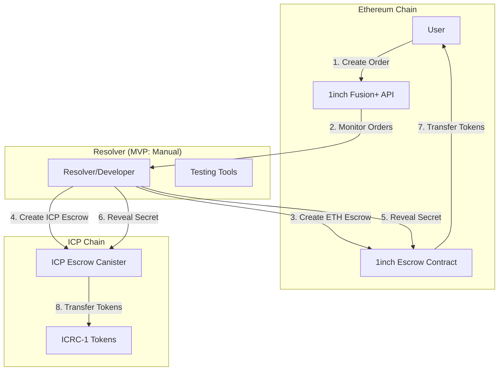

# Design Document (Comprehensive - Future Reference)

## Document Purpose and Status

**What This Is:** A comprehensive design document for extending 1inch Fusion+ to support ICP with full production-ready features including automated timelock handling, DAO governance, multi-provider RPC strategies, and complex recovery systems.

**Why We Rejected It for MVP:** This design is significantly over-engineered for our MVP scope. It includes production-grade features like automated timers, governance systems, and complex recovery mechanisms that are beyond our hackathon MVP goals. Following this design would lead to the same over-engineering issues that caused the failure of our first attempt (`.kiro` project).

**Why We Keep It:** Despite being over-engineered for MVP, this document contains valuable technical insights and ICP-specific considerations that will be essential for future development phases. It serves as a comprehensive reference for:

- Stretch goals implementation
- Production deployment planning
- Advanced feature development
- Technical architecture reference

**Current Status:** Archived as future reference - not for immediate implementation.

---

## Overview

This document outlines the design for extending 1inch Fusion+ to support Internet Computer Protocol (ICP), enabling atomic cross-chain swaps between Ethereum and ICP. The solution leverages existing 1inch Fusion+ infrastructure on Ethereum while implementing new ICP escrow canisters that preserve the core HTLC (Hashed Timelock Contract) functionality.

The design follows a 4-phase process: Announcement, Deposit, Execution, and Recovery, with the MVP focusing on manual coordination and testing tools to demonstrate real cross-chain token transfers. This design specifically addresses ICP's unique characteristics including Chain Fusion trust model, canister immutability, cycle management, and automated timelock capabilities.

## Architecture

### High-Level Architecture



### Core Components

#### 1. ICP Escrow Canister (Our Implementation)

- **Purpose**: Implements HTLC functionality on ICP
- **Language**: Rust using IC CDK
- **Responsibilities**:
  - Hashlock verification using SHA256
  - Timelock enforcement using IC time API
  - ICRC-1 token management
  - Cross-chain state verification via HTTP outcalls
  - Escrow lifecycle management

#### 2. Ethereum Integration (Use Existing)

- **Purpose**: Leverage existing 1inch Fusion+ infrastructure
- **Components**: EscrowSrc, EscrowDst, Fusion+ APIs
- **Responsibilities**:
  - Order creation and management
  - Ethereum-side escrow functionality
  - Resolver network coordination

#### 3. Testing and Coordination Tools (Our Implementation)

- **Purpose**: Enable manual testing and demonstration
- **Components**: CLI scripts, monitoring tools, balance checkers
- **Responsibilities**:
  - Cross-chain coordination
  - State verification
  - Demo execution

## Components and Interfaces

### ICP Escrow Canister Interface

```rust
// Core escrow management
#[update]
pub async fn create_escrow(params: CreateEscrowParams) -> Result<String, EscrowError>;

#[update]
pub async fn deposit_tokens(escrow_id: String, amount: u64) -> Result<(), EscrowError>;

#[update]
pub async fn claim_escrow(escrow_id: String, preimage: Vec<u8>) -> Result<(), EscrowError>;

#[update]
pub async fn refund_escrow(escrow_id: String) -> Result<(), EscrowError>;

// Query methods
#[query]
pub fn get_escrow_status(escrow_id: String) -> Result<EscrowStatus, EscrowError>;

#[query]
pub fn verify_ethereum_escrow(eth_escrow_address: String) -> Result<bool, EscrowError>;

// Cross-chain verification
#[update]
pub async fn verify_ethereum_state(eth_tx_hash: String) -> Result<EthereumState, EscrowError>;
```

### Data Models

#### CreateEscrowParams

```rust
pub struct CreateEscrowParams {
    pub hashlock: Vec<u8>,           // SHA256 hash of secret
    pub timelock: u64,               // Nanoseconds since epoch
    pub token_canister: Principal,   // ICRC-1 token canister ID
    pub amount: u64,                 // Token amount in smallest unit
    pub recipient: Principal,        // Token recipient on completion
    pub depositor: Principal,        // Original token depositor
    pub eth_escrow_address: String,  // Corresponding Ethereum escrow
}
```

#### EscrowStatus

```rust
pub struct EscrowStatus {
    pub id: String,
    pub state: EscrowState,
    pub hashlock: Vec<u8>,
    pub timelock: u64,
    pub token_info: TokenInfo,
    pub participants: Participants,
    pub created_at: u64,
    pub updated_at: u64,
}

pub enum EscrowState {
    Created,
    Funded,
    Claimed,
    Refunded,
    Expired,
}
```

### Cross-Chain Communication

#### HTTP Outcalls for Ethereum Verification

```rust
pub async fn verify_ethereum_escrow(
    eth_escrow_address: String,
    expected_params: EthereumEscrowParams,
) -> Result<bool, HttpOutcallError> {
    let rpc_url = "https://sepolia.infura.io/v3/YOUR_PROJECT_ID";
    let request = HttpRequest {
        url: rpc_url.to_string(),
        method: HttpMethod::POST,
        headers: vec![("Content-Type".to_string(), "application/json".to_string())],
        body: Some(json_rpc_call.as_bytes().to_vec()),
    };

    let response = http_request(request).await?;
    // Parse response and verify escrow parameters
    parse_and_verify_escrow_response(response, expected_params)
}
```

## Data Models

### Token Management

#### ICRC-1 Integration

```rust
pub struct TokenInfo {
    pub canister_id: Principal,
    pub symbol: String,
    pub decimals: u8,
    pub fee: u64,
}

pub async fn transfer_tokens(
    token_canister: Principal,
    to: Principal,
    amount: u64,
) -> Result<u64, TransferError> {
    let transfer_args = TransferArgs {
        from_subaccount: None,
        to: Account {
            owner: to,
            subaccount: None,
        },
        amount: Nat::from(amount),
        fee: None,
        memo: None,
        created_at_time: Some(ic_cdk::api::time()),
    };

    ic_cdk::call(token_canister, "icrc1_transfer", (transfer_args,)).await
}
```

### Timelock Management

#### Time-based Access Control

```rust
pub struct TimelockConfig {
    pub deposit_window: u64,      // Time to deposit after creation
    pub claim_window: u64,        // Time to claim after deposit
    pub refund_delay: u64,        // Delay before refund allowed
    pub public_refund_delay: u64, // Additional delay for public refund
}

pub fn check_timelock_status(escrow: &Escrow, current_time: u64) -> TimelockStatus {
    if current_time < escrow.timelock {
        TimelockStatus::Active
    } else if current_time < escrow.timelock + escrow.config.refund_delay {
        TimelockStatus::RefundAllowed
    } else {
        TimelockStatus::PublicRefundAllowed
    }
}
```

## Error Handling

### Error Types and Recovery

#### Comprehensive Error Handling

```rust
#[derive(Debug, Clone)]
pub enum EscrowError {
    // Creation errors
    InvalidHashlock,
    InvalidTimelock,
    InvalidTokenCanister,
    InvalidAmount,

    // State errors
    EscrowNotFound,
    InvalidState,
    AlreadyClaimed,
    AlreadyRefunded,

    // Timelock errors
    TimelockNotExpired,
    TimelockExpired,

    // Token errors
    InsufficientBalance,
    TransferFailed,
    TokenNotSupported,

    // Cross-chain errors
    EthereumVerificationFailed,
    HttpOutcallFailed,
    InvalidEthereumState,

    // Authorization errors
    Unauthorized,
    InvalidCaller,
}
```

#### Recovery Mechanisms

```rust
pub async fn handle_partial_execution_failure(
    escrow_id: String,
    failure_type: FailureType,
) -> Result<RecoveryAction, EscrowError> {
    match failure_type {
        FailureType::EthereumClaimFailed => {
            // Ethereum claim failed, allow ICP refund
            Ok(RecoveryAction::AllowRefund)
        },
        FailureType::ICPClaimFailed => {
            // ICP claim failed, coordinate with Ethereum
            Ok(RecoveryAction::CoordinateRefund)
        },
        FailureType::NetworkFailure => {
            // Network issues, retry mechanism
            Ok(RecoveryAction::RetryOperation)
        },
    }
}
```

## Testing Strategy

### MVP Testing Approach

#### Manual Testing Framework

```bash
# 1. Deploy ICP canister
dfx deploy --network ic escrow_canister

# 2. Create test escrow
dfx canister call escrow_canister create_escrow '(
  record {
    hashlock = blob "hash_of_secret";
    timelock = 1_700_000_000_000_000_000 : nat64;
    token_canister = principal "rdmx6-jaaaa-aaaah-qcaiq-cai";
    amount = 1_000_000 : nat64;
    recipient = principal "user_principal";
    depositor = principal "resolver_principal";
    eth_escrow_address = "0x1234...";
  }
)'

# 3. Deposit tokens
dfx canister call escrow_canister deposit_tokens '("escrow_id", 1_000_000 : nat64)'

# 4. Claim with secret
dfx canister call escrow_canister claim_escrow '("escrow_id", blob "secret_preimage")'
```

#### Cross-Chain Coordination Testing

```javascript
// Ethereum side testing (using ethers.js)
const ethers = require("ethers");

async function testEthereumEscrow() {
  const provider = new ethers.providers.JsonRpcProvider("https://sepolia.infura.io/v3/...");
  const escrowContract = new ethers.Contract(escrowAddress, escrowABI, provider);

  // Verify escrow creation
  const escrowState = await escrowContract.getEscrowState();
  console.log("Ethereum escrow state:", escrowState);

  // Execute claim
  const tx = await escrowContract.withdraw(secretPreimage);
  await tx.wait();
  console.log("Ethereum claim successful");
}
```

#### Integration Testing Scripts

```bash
#!/bin/bash
# integration_test.sh

echo "Starting cross-chain swap test..."

# 1. Create Ethereum escrow (using existing 1inch contracts)
echo "Creating Ethereum escrow..."
node scripts/create_eth_escrow.js

# 2. Create ICP escrow
echo "Creating ICP escrow..."
dfx canister call escrow_canister create_escrow "$ESCROW_PARAMS"

# 3. Deposit tokens on both chains
echo "Depositing tokens..."
node scripts/deposit_eth_tokens.js
dfx canister call escrow_canister deposit_tokens "$DEPOSIT_PARAMS"

# 4. Execute atomic swap
echo "Executing swap..."
node scripts/claim_eth_escrow.js "$SECRET"
dfx canister call escrow_canister claim_escrow "$ESCROW_ID" "$SECRET"

# 5. Verify completion
echo "Verifying swap completion..."
node scripts/verify_balances.js
dfx canister call escrow_canister get_escrow_status "$ESCROW_ID"

echo "Cross-chain swap test completed!"
```

### Testing Phases

#### Phase 1: Unit Testing

- Individual canister methods
- Hashlock verification
- Timelock enforcement
- Token transfer logic
- Error handling

#### Phase 2: Integration Testing

- Cross-chain communication
- HTTP outcalls to Ethereum
- State synchronization
- Recovery mechanisms

#### Phase 3: End-to-End Testing

- Complete swap workflows
- Both directions (ICP→ETH, ETH→ICP)
- Failure scenarios
- Recovery procedures

#### Phase 4: Live Network Testing

- Testnet deployment
- Real token transfers
- Performance validation
- Security verification

### Test Data and Scenarios

#### Test Scenarios

```rust
pub struct TestScenario {
    pub name: String,
    pub description: String,
    pub setup: TestSetup,
    pub execution: TestExecution,
    pub expected_outcome: TestOutcome,
}

// Example test scenarios
pub fn get_test_scenarios() -> Vec<TestScenario> {
    vec![
        TestScenario {
            name: "successful_icp_to_eth_swap".to_string(),
            description: "Complete ICP to ETH swap with valid secret".to_string(),
            setup: TestSetup::ICPToETH,
            execution: TestExecution::ValidSecret,
            expected_outcome: TestOutcome::SwapCompleted,
        },
        TestScenario {
            name: "timelock_expiration_refund".to_string(),
            description: "Refund after timelock expiration".to_string(),
            setup: TestSetup::ExpiredTimelock,
            execution: TestExecution::RefundAttempt,
            expected_outcome: TestOutcome::RefundSuccessful,
        },
        // Additional test scenarios...
    ]
}
```

## Implementation Architecture

### Canister Architecture Decision

#### Single Canister Approach (MVP)

- **Rationale**: Simplified deployment and testing for MVP
- **Benefits**: Lower complexity, easier debugging, cost-effective
- **Limitations**: Single point of failure, limited scalability
- **Migration Path**: Can evolve to factory pattern for production

#### Factory Pattern (Future Enhancement)

- **Rationale**: Scalable architecture for production deployment
- **Benefits**: Isolated escrows, better resource management
- **Implementation**: Factory canister creates individual escrow canisters
- **Considerations**: Higher complexity, increased cycle costs

### Resource Management

#### Cycle Optimization

```rust
// Efficient state management
pub struct EscrowManager {
    escrows: BTreeMap<String, Escrow>,
    active_count: u64,
    total_processed: u64,
}

impl EscrowManager {
    pub fn cleanup_expired_escrows(&mut self) {
        let current_time = ic_cdk::api::time();
        self.escrows.retain(|_, escrow| {
            current_time < escrow.timelock + CLEANUP_DELAY
        });
    }

    pub fn get_memory_usage(&self) -> u64 {
        // Calculate approximate memory usage
        self.escrows.len() as u64 * std::mem::size_of::<Escrow>() as u64
    }
}
```

#### Performance Considerations

- **Batch Operations**: Group multiple operations to reduce cycle costs
- **Lazy Loading**: Load escrow data only when needed
- **Efficient Serialization**: Use compact data structures
- **Memory Management**: Regular cleanup of expired escrows

### Security Architecture

#### Access Control

```rust
pub fn verify_caller_authorization(
    caller: Principal,
    escrow: &Escrow,
    operation: Operation,
) -> Result<(), EscrowError> {
    match operation {
        Operation::Deposit => {
            if caller != escrow.depositor {
                return Err(EscrowError::Unauthorized);
            }
        },
        Operation::Claim => {
            // Anyone can claim with valid secret
            Ok(())
        },
        Operation::Refund => {
            if ic_cdk::api::time() < escrow.timelock {
                return Err(EscrowError::TimelockNotExpired);
            }
            if caller != escrow.depositor && caller != escrow.recipient {
                return Err(EscrowError::Unauthorized);
            }
        },
    }
    Ok(())
}
```

#### Cryptographic Security

- **Hash Function**: SHA256 for hashlock verification
- **Secret Generation**: Secure random number generation
- **Replay Protection**: Nonce-based transaction ordering
- **Input Validation**: Comprehensive parameter validation

## Security Model and Trust Assumptions

### Chain Fusion Trust Model

The ICP Chain Fusion architecture requires specific trust assumptions that differ from traditional blockchain bridges:

#### Trust Requirements

- **Subnet Node Consensus**: Users must trust that a supermajority of subnet nodes are honest
- **RPC Provider Reliability**: Cross-chain verification depends on external RPC providers
- **Consensus Mechanism**: HTTPS outcalls require consensus among subnet nodes for security

#### Fallback Strategies

```rust
pub struct RpcConfig {
    pub primary_providers: Vec<String>,
    pub fallback_providers: Vec<String>,
    pub consensus_threshold: u8,
    pub timeout_seconds: u64,
}

pub async fn verify_with_consensus(
    providers: &[String],
    request: &EthereumRequest,
) -> Result<EthereumResponse, ConsensusError> {
    let responses = futures::future::join_all(
        providers.iter().map(|url| query_ethereum_rpc(url, request))
    ).await;

    // Require majority consensus
    let consensus_response = find_consensus_response(responses, providers.len() / 2 + 1)?;
    Ok(consensus_response)
}
```

#### User Transparency

- **Documentation**: Clear explanation of trust assumptions in user-facing documentation
- **Risk Disclosure**: Explicit disclosure of RPC provider dependencies
- **Fallback Notification**: User notification when fallback providers are used

### Canister Security and Immutability

#### Development vs Production Security Model

**Development Phase (Mutable Canister)**:

```rust
// Development canister with upgrade capability
pub struct DevelopmentCanister {
    pub controllers: Vec<Principal>,
    pub upgrade_capability: bool,
    pub security_warnings: Vec<String>,
}
```

**Production Phase (Immutable Canister)**:

```rust
// Production canister options
pub enum ProductionSecurity {
    CompleteImmutability {
        controllers_removed: bool,
        blackhole_canister: Option<Principal>,
    },
    DaoGovernance {
        sns_canister: Principal,
        proposal_threshold: u64,
        voting_period: u64,
    },
}
```

#### Immutability Implementation

```rust
pub async fn make_canister_immutable() -> Result<(), ImmutabilityError> {
    // Option 1: Remove all controllers
    ic_cdk::api::management_canister::main::update_settings(
        UpdateSettingsArgument {
            canister_id: ic_cdk::api::id(),
            settings: CanisterSettings {
                controllers: Some(vec![]), // Empty controllers list
                ..Default::default()
            },
        }
    ).await?;

    // Option 2: Transfer to blackhole canister
    // let blackhole = Principal::from_text("rdmx6-jaaaa-aaaah-qcaiq-cai")?;
    // transfer_to_blackhole(blackhole).await?;

    Ok(())
}
```

#### DAO Governance Option

```rust
pub struct SnsGovernance {
    pub sns_canister_id: Principal,
    pub proposal_types: Vec<ProposalType>,
    pub voting_threshold: u64,
    pub execution_delay: u64,
}

pub enum ProposalType {
    CanisterUpgrade,
    ParameterChange,
    EmergencyStop,
}
```

## Cycle Management and Economics

### ICP's Reverse Gas Model

Unlike Ethereum where users pay gas fees, ICP uses a reverse gas model where developers pay for execution:

#### Economic Model

```rust
pub struct CycleEconomics {
    pub initial_funding: u64,           // Cycles funded at deployment
    pub operation_costs: OperationCosts, // Cost per operation type
    pub funding_strategy: FundingStrategy,
    pub monitoring_thresholds: MonitoringConfig,
}

pub struct OperationCosts {
    pub escrow_creation: u64,    // ~1M cycles
    pub token_transfer: u64,     // ~500K cycles
    pub http_outcall: u64,       // ~2M cycles per call
    pub timer_execution: u64,    // ~100K cycles
}
```

#### Cycle Management Implementation

```rust
pub async fn check_cycle_balance() -> Result<u64, CycleError> {
    let balance = ic_cdk::api::canister_balance();

    if balance < MINIMUM_CYCLE_THRESHOLD {
        // Alert mechanism
        log_cycle_warning(balance).await;

        // Emergency funding if available
        if let Some(funding_source) = get_emergency_funding().await {
            request_cycle_funding(funding_source).await?;
        }
    }

    Ok(balance)
}

pub struct DoSProtection {
    pub rate_limits: HashMap<Principal, RateLimit>,
    pub cycle_cost_limits: HashMap<Operation, u64>,
    pub emergency_stop: bool,
}

pub fn enforce_rate_limit(caller: Principal, operation: Operation) -> Result<(), RateLimitError> {
    let limit = self.rate_limits.get(&caller).unwrap_or(&DEFAULT_RATE_LIMIT);

    if limit.is_exceeded() {
        return Err(RateLimitError::ExceededLimit);
    }

    limit.record_operation(operation);
    Ok(())
}
```

### Sustainable Operation Strategy

#### Funding Models

```rust
pub enum FundingStrategy {
    DeveloperFunded {
        initial_cycles: u64,
        refill_threshold: u64,
        refill_amount: u64,
    },
    CommunityFunded {
        donation_address: Principal,
        funding_proposals: Vec<FundingProposal>,
    },
    RevenueModel {
        fee_per_swap: u64,
        fee_collection_address: Principal,
    },
}
```

## Automated Timelock Handling

### ICP Timer Integration

ICP's unique timer capabilities enable automated escrow management:

#### Timer-Based Automation

```rust
use ic_cdk_timers::{set_timer, TimerId};

pub struct TimerManager {
    pub active_timers: HashMap<String, TimerId>, // escrow_id -> timer_id
    pub timer_configs: HashMap<String, TimerConfig>,
}

pub struct TimerConfig {
    pub escrow_id: String,
    pub expiration_time: u64,
    pub action: TimerAction,
    pub retry_count: u8,
}

pub enum TimerAction {
    AutoRefund,
    NotifyExpiration,
    CleanupEscrow,
}

pub fn schedule_escrow_timer(escrow_id: String, expiration_time: u64) -> Result<TimerId, TimerError> {
    let duration = Duration::from_nanos(expiration_time - ic_cdk::api::time());

    let timer_id = set_timer(duration, move || {
        ic_cdk::spawn(async move {
            handle_escrow_expiration(escrow_id.clone()).await;
        });
    });

    TIMER_MANAGER.with(|tm| {
        tm.borrow_mut().active_timers.insert(escrow_id.clone(), timer_id);
    });

    Ok(timer_id)
}

pub async fn handle_escrow_expiration(escrow_id: String) {
    match get_escrow_status(&escrow_id) {
        Ok(EscrowStatus { state: EscrowState::Funded, .. }) => {
            // Automatic refund
            if let Err(e) = execute_automatic_refund(&escrow_id).await {
                log_error(&format!("Auto-refund failed for {}: {:?}", escrow_id, e));
                // Fallback to manual intervention
                notify_manual_intervention_needed(&escrow_id).await;
            }
        },
        _ => {
            // Cleanup expired escrow
            cleanup_expired_escrow(&escrow_id).await;
        }
    }
}
```

#### Graceful Timer Failure Handling

```rust
pub async fn execute_automatic_refund(escrow_id: &str) -> Result<(), RefundError> {
    // Attempt automatic refund with retries
    for attempt in 1..=MAX_RETRY_ATTEMPTS {
        match refund_escrow_internal(escrow_id).await {
            Ok(_) => {
                log_info(&format!("Auto-refund successful for {} on attempt {}", escrow_id, attempt));
                return Ok(());
            },
            Err(e) if attempt < MAX_RETRY_ATTEMPTS => {
                log_warning(&format!("Auto-refund attempt {} failed for {}: {:?}", attempt, escrow_id, e));
                // Exponential backoff
                let delay = Duration::from_secs(2_u64.pow(attempt));
                set_timer(delay, || {});
            },
            Err(e) => {
                log_error(&format!("Auto-refund failed permanently for {}: {:?}", escrow_id, e));
                return Err(e);
            }
        }
    }

    Err(RefundError::MaxRetriesExceeded)
}
```

#### User Choice: Automatic vs Manual

```rust
pub struct RefundPreferences {
    pub automatic_refund: bool,
    pub notification_preferences: NotificationConfig,
    pub manual_override: bool,
}

pub async fn configure_refund_behavior(
    escrow_id: String,
    preferences: RefundPreferences,
) -> Result<(), ConfigError> {
    if preferences.automatic_refund {
        schedule_escrow_timer(escrow_id, calculate_expiration_time())?;
    } else {
        // Manual refund only - just schedule notification
        schedule_notification_timer(escrow_id, calculate_expiration_time())?;
    }

    Ok(())
}
```

## Cross-Chain Communication Robustness

### HTTP Outcall Resilience

#### Multi-Provider Strategy

```rust
pub struct HttpOutcallManager {
    pub primary_providers: Vec<RpcProvider>,
    pub fallback_providers: Vec<RpcProvider>,
    pub provider_health: HashMap<String, ProviderHealth>,
    pub retry_config: RetryConfig,
}

pub struct RpcProvider {
    pub url: String,
    pub auth_header: Option<String>,
    pub rate_limit: RateLimit,
    pub reliability_score: f64,
}

pub struct RetryConfig {
    pub max_attempts: u8,
    pub base_delay_ms: u64,
    pub max_delay_ms: u64,
    pub backoff_multiplier: f64,
}

pub async fn robust_ethereum_call(
    request: EthereumRequest,
) -> Result<EthereumResponse, HttpOutcallError> {
    let mut last_error = None;

    // Try primary providers first
    for provider in &self.primary_providers {
        match execute_with_retry(provider, &request, &self.retry_config).await {
            Ok(response) => return Ok(response),
            Err(e) => {
                log_warning(&format!("Primary provider {} failed: {:?}", provider.url, e));
                last_error = Some(e);
            }
        }
    }

    // Fallback to secondary providers
    for provider in &self.fallback_providers {
        match execute_with_retry(provider, &request, &self.retry_config).await {
            Ok(response) => {
                log_info(&format!("Fallback provider {} succeeded", provider.url));
                return Ok(response);
            },
            Err(e) => {
                log_warning(&format!("Fallback provider {} failed: {:?}", provider.url, e));
                last_error = Some(e);
            }
        }
    }

    Err(last_error.unwrap_or(HttpOutcallError::AllProvidersFailed))
}

async fn execute_with_retry(
    provider: &RpcProvider,
    request: &EthereumRequest,
    retry_config: &RetryConfig,
) -> Result<EthereumResponse, HttpOutcallError> {
    let mut delay = retry_config.base_delay_ms;

    for attempt in 1..=retry_config.max_attempts {
        match http_request_to_provider(provider, request).await {
            Ok(response) => return Ok(response),
            Err(e) if attempt < retry_config.max_attempts => {
                log_debug(&format!("Attempt {} failed, retrying in {}ms", attempt, delay));

                // Exponential backoff with jitter
                let jitter = (delay as f64 * 0.1 * rand::random::<f64>()) as u64;
                set_timer(Duration::from_millis(delay + jitter), || {});

                delay = std::cmp::min(
                    (delay as f64 * retry_config.backoff_multiplier) as u64,
                    retry_config.max_delay_ms
                );
            },
            Err(e) => return Err(e),
        }
    }

    Err(HttpOutcallError::MaxRetriesExceeded)
}
```

### Manual Recovery Procedures

#### Inconsistent State Recovery

```rust
pub struct RecoveryManager {
    pub pending_recoveries: HashMap<String, RecoveryCase>,
    pub recovery_procedures: HashMap<RecoveryType, RecoveryProcedure>,
}

pub enum RecoveryType {
    EthereumClaimFailed,
    ICPClaimFailed,
    CrossChainInconsistency,
    NetworkPartition,
}

pub struct RecoveryCase {
    pub escrow_id: String,
    pub recovery_type: RecoveryType,
    pub detected_at: u64,
    pub evidence: RecoveryEvidence,
    pub status: RecoveryStatus,
}

pub async fn detect_and_handle_inconsistency(
    escrow_id: &str,
) -> Result<(), RecoveryError> {
    let icp_state = get_escrow_status(escrow_id)?;
    let eth_state = verify_ethereum_escrow_state(escrow_id).await?;

    match (icp_state.state, eth_state.state) {
        (EscrowState::Claimed, EthereumEscrowState::Funded) => {
            // ICP claimed but Ethereum not - potential issue
            initiate_recovery(escrow_id, RecoveryType::EthereumClaimFailed).await?;
        },
        (EscrowState::Funded, EthereumEscrowState::Claimed) => {
            // Ethereum claimed but ICP not - potential issue
            initiate_recovery(escrow_id, RecoveryType::ICPClaimFailed).await?;
        },
        (EscrowState::Claimed, EthereumEscrowState::Claimed) => {
            // Both claimed - success, no recovery needed
            Ok(())
        },
        _ => {
            // Other states may be normal or require investigation
            Ok(())
        }
    }
}

pub async fn initiate_recovery(
    escrow_id: &str,
    recovery_type: RecoveryType,
) -> Result<(), RecoveryError> {
    let recovery_case = RecoveryCase {
        escrow_id: escrow_id.to_string(),
        recovery_type: recovery_type.clone(),
        detected_at: ic_cdk::api::time(),
        evidence: collect_recovery_evidence(escrow_id).await?,
        status: RecoveryStatus::Initiated,
    };

    // Store recovery case
    RECOVERY_MANAGER.with(|rm| {
        rm.borrow_mut().pending_recoveries.insert(escrow_id.to_string(), recovery_case);
    });

    // Execute recovery procedure
    let procedure = get_recovery_procedure(&recovery_type)?;
    execute_recovery_procedure(escrow_id, procedure).await?;

    Ok(())
}
```

## Transparency and Governance

### Open Source and Reproducible Builds

#### Code Transparency

```rust
pub struct TransparencyConfig {
    pub source_code_url: String,
    pub commit_hash: String,
    pub build_instructions: String,
    pub verification_tools: Vec<String>,
}

pub fn get_canister_metadata() -> CanisterMetadata {
    CanisterMetadata {
        version: env!("CARGO_PKG_VERSION").to_string(),
        git_commit: env!("GIT_COMMIT_HASH").to_string(),
        build_timestamp: env!("BUILD_TIMESTAMP").to_string(),
        source_url: "https://github.com/your-org/fusion-plus-icp".to_string(),
        license: "MIT".to_string(),
    }
}

// Reproducible build verification
pub fn verify_build_reproducibility() -> Result<BuildVerification, VerificationError> {
    let expected_hash = get_expected_wasm_hash();
    let actual_hash = calculate_deployed_wasm_hash();

    if expected_hash == actual_hash {
        Ok(BuildVerification::Verified)
    } else {
        Err(VerificationError::HashMismatch {
            expected: expected_hash,
            actual: actual_hash,
        })
    }
}
```

### Governance Models

#### SNS Integration for DAO Governance

```rust
pub struct SnsIntegration {
    pub sns_canister_id: Principal,
    pub governance_token: Principal,
    pub proposal_types: Vec<ProposalType>,
    pub voting_config: VotingConfig,
}

pub struct VotingConfig {
    pub proposal_threshold: u64,
    pub voting_period_seconds: u64,
    pub execution_delay_seconds: u64,
    pub quorum_percentage: u8,
}

pub async fn submit_governance_proposal(
    proposal: GovernanceProposal,
) -> Result<ProposalId, GovernanceError> {
    // Submit to SNS for community voting
    let proposal_id = ic_cdk::call(
        self.sns_canister_id,
        "submit_proposal",
        (proposal,)
    ).await?;

    Ok(proposal_id)
}
```

This comprehensive design addresses all the ICP-specific requirements while maintaining the core functionality needed for atomic cross-chain swaps. The design provides a robust foundation for implementing the Fusion+ ICP extension with proper security, transparency, and operational considerations for the Internet Computer platform.
