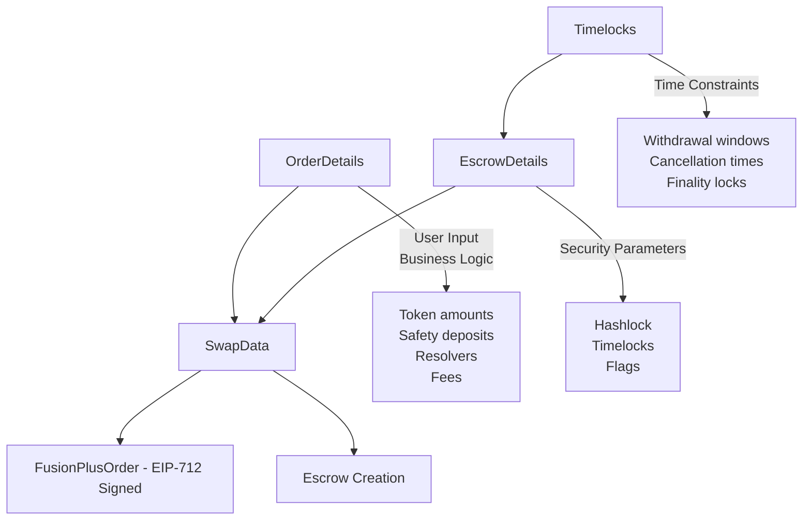

# ICP Fusion+ Implementation - Pseudo Code

> **Comprehensive Rust pseudo-code implementation** for replicating the Fusion+ protocol on the Internet Computer Protocol (ICP), maintaining the same architectural patterns as the EVM implementation.

## Overview

This document provides a complete pseudo-code implementation that replicates the EVM Fusion+ architecture on ICP using canisters instead of smart contracts.

### **Architecture Mapping: EVM → ICP**

| EVM Component           | ICP Component             | Purpose                              |
| ----------------------- | ------------------------- | ------------------------------------ |
| `EscrowFactory`         | `EscrowFactoryCanister`   | Creates and manages escrow instances |
| `EscrowSrc`/`EscrowDst` | `EscrowCanister`          | Individual escrow logic              |
| Proxy Contracts         | Dynamic Canister Creation | Deterministic escrow addresses       |
| Limit Order Protocol    | `OrderExecutionCanister`  | Handles EIP-712 order execution      |
| Relayer Service         | `RelayerCanister`         | Manages orders and secrets (Fusion+) |

## 📚 **References**

### **Repository Code References**

- [`contracts/EscrowFactory.sol`](../contracts/EscrowFactory.sol) - Factory pattern implementation
- [`contracts/BaseEscrowFactory.sol`](../contracts/BaseEscrowFactory.sol) - Core `_postInteraction` logic
- [`contracts/EscrowSrc.sol`](../contracts/EscrowSrc.sol) - Source escrow implementation
- [`contracts/EscrowDst.sol`](../contracts/EscrowDst.sol) - Destination escrow implementation

### **Documentation References**

- [Fusion to Fusion+ Upgrade Guide](fusion-to-fusion-plus-upgrade.md) - Key differences between versions
- [Architecture Deep Dive](architecture.md) - Factory/Proxy pattern explanation
- [Order Data Structure](order-data-structure.md) - Complete order format
- [EIP-712 Order Execution](eip712-order-execution.md) - How orders are executed

### **Whitepaper References**

- [1inch Fusion+ Whitepaper](1inch-fusion-plus-whitepaper.md) - Official specification
- Phase 1: Announcement (lines 84-90)
- Phase 2: Deposit (lines 92-98)
- Phase 3: Withdrawal (lines 100-106)

---

## 🏗️ **Core Data Structures & Their Relationships**

> **Key Understanding**: These structures serve different purposes in the order lifecycle and are combined together during execution.

### **Data Structure Relationships**



### **1. OrderDetails (User Input Layer)**

```rust
// Based on: test/utils/libraries/CrossChainTestLib.sol (lines 64-77)
// PURPOSE: Contains all the business logic parameters that users specify
#[derive(CandidType, Deserialize, Clone, Debug)]
pub struct OrderDetails {
    pub maker: Principal,             // User creating the order
    pub receiver: Principal,          // Who gets the destination tokens
    pub src_token: TokenId,           // What token to sell
    pub dst_token: TokenId,           // What token to buy
    pub src_amount: u64,              // How much to sell
    pub dst_amount: u64,              // How much to receive
    pub src_safety_deposit: u64,      // Economic security for source chain
    pub dst_safety_deposit: u64,      // Economic security for destination chain
    pub resolvers: Vec<Principal>,    // Who can execute (empty = public)
    pub resolver_fee: u32,            // Fee for the resolver
    pub auction_details: Vec<u8>,     // Dutch auction parameters
}
```

### **2. Timelocks (Security Timing Layer)**

```rust
// Based on: contracts/libraries/TimelocksLib.sol
// PURPOSE: Defines all time-based security windows for the escrow
#[derive(CandidType, Deserialize, Clone, Debug)]
pub struct Timelocks {
    pub src_withdrawal: u64,          // When taker can withdraw (normal case)
    pub src_public_withdrawal: u64,   // When anyone can withdraw (fallback)
    pub src_cancellation: u64,        // When maker can cancel
    pub src_public_cancellation: u64, // When anyone can cancel (emergency)
    pub finality_lock: u64,           // 🆕 Fusion+: Chain finality protection
}
```

### **3. EscrowDetails (Security Parameters Layer)**

```rust
// Based on: test/utils/libraries/CrossChainTestLib.sol (lines 79-84)
// PURPOSE: Contains security-specific parameters for escrow creation
#[derive(CandidType, Deserialize, Clone, Debug)]
pub struct EscrowDetails {
    pub hashlock: [u8; 32],           // Hash of the secret (atomic swap lock)
    pub timelocks: Timelocks,         // ⬆️ CONTAINS Timelocks struct
    pub fake_order: bool,             // Testing flag
    pub allow_multiple_fills: bool,   // Whether order can be partially filled
}
```

### **4. FusionPlusOrder (EIP-712 Signed Order)**

```rust
// Based on: docs/order-data-structure.md + contracts/interfaces/IOrderMixin.sol
// PURPOSE: The actual cryptographically signed order that gets executed
#[derive(CandidType, Deserialize, Clone, Debug)]
pub struct FusionPlusOrder {
    pub salt: u64,                    // Unique identifier
    pub maker: Principal,             // ⬆️ FROM OrderDetails.maker
    pub receiver: Principal,          // ⬆️ FROM OrderDetails.receiver
    pub maker_asset: TokenId,         // ⬆️ FROM OrderDetails.src_token
    pub taker_asset: TokenId,         // ⬆️ FROM OrderDetails.dst_token
    pub making_amount: u64,           // ⬆️ FROM OrderDetails.src_amount
    pub taking_amount: u64,           // ⬆️ FROM OrderDetails.dst_amount
    pub secret_hash: [u8; 32],        // ⬆️ FROM EscrowDetails.hashlock (Fusion+)
    pub maker_traits: MakerTraits,    // Order configuration flags
    pub chain_id_src: u64,            // Source chain identifier
    pub chain_id_dst: u64,            // Destination chain identifier
}
```

### **5. How They Work Together (Complete Flow)**

```rust
// STEP 1: User creates OrderDetails (business parameters)
let order_details = OrderDetails {
    maker: user_principal,
    receiver: user_principal,
    src_token: TokenId::ICP,
    dst_token: TokenId::USDC,
    src_amount: 1000_000_000,         // 10 ICP
    dst_amount: 100_000_000,          // 100 USDC
    src_safety_deposit: 50_000_000,   // 0.5 ICP safety
    dst_safety_deposit: 5_000_000,    // 5 USDC safety
    resolvers: vec![],                // Public order
    resolver_fee: 1000,               // 0.1% fee
    auction_details: build_auction_params(),
};

// STEP 2: System creates Timelocks (security timing)
let timelocks = Timelocks {
    src_withdrawal: current_time + 3600,      // 1 hour
    src_public_withdrawal: current_time + 7200, // 2 hours
    src_cancellation: current_time + 10800,   // 3 hours
    src_public_cancellation: current_time + 14400, // 4 hours
    finality_lock: 600,                       // 10 minutes (Fusion+)
};

// STEP 3: System creates EscrowDetails (security parameters)
let secret = generate_random_secret();
let escrow_details = EscrowDetails {
    hashlock: sha256(&secret),        // Secret hash for atomic swap
    timelocks,                        // ⬅️ EMBEDS the Timelocks struct
    fake_order: false,
    allow_multiple_fills: false,
};

// STEP 4: Convert to FusionPlusOrder (EIP-712 signable)
let fusion_order = FusionPlusOrder {
    salt: generate_salt(),
    maker: order_details.maker,              // ⬅️ FROM OrderDetails
    receiver: order_details.receiver,        // ⬅️ FROM OrderDetails
    maker_asset: order_details.src_token,    // ⬅️ FROM OrderDetails
    taker_asset: order_details.dst_token,    // ⬅️ FROM OrderDetails
    making_amount: order_details.src_amount, // ⬅️ FROM OrderDetails
    taking_amount: order_details.dst_amount, // ⬅️ FROM OrderDetails
    secret_hash: escrow_details.hashlock,    // ⬅️ FROM EscrowDetails
    maker_traits: MakerTraits::default(),
    chain_id_src: ChainId::ICP as u64,
    chain_id_dst: ChainId::Ethereum as u64,
};

// STEP 5: User signs the FusionPlusOrder
let signature = sign_eip712_order(&fusion_order, &user_private_key);

// STEP 6: During escrow creation, all data is combined
let escrow_init_args = EscrowInitArgs {
    order_hash: compute_order_hash(&fusion_order),
    hashlock: escrow_details.hashlock,       // ⬅️ FROM EscrowDetails
    maker: fusion_order.maker,               // ⬅️ FROM FusionPlusOrder
    taker: resolver_principal,
    token: fusion_order.maker_asset,         // ⬅️ FROM FusionPlusOrder
    amount: fusion_order.making_amount,      // ⬅️ FROM FusionPlusOrder
    safety_deposit: order_details.src_safety_deposit, // ⬅️ FROM OrderDetails
    timelocks: escrow_details.timelocks,     // ⬅️ FROM EscrowDetails
    escrow_type: EscrowType::Source,
};
```

### **2. Escrow State Structure (Shared by Source & Destination)**

> **Key Point**: `EscrowState` is the **main shared structure** used by both source and destination escrows. The difference is in the **timelock stages** and **withdrawal logic**, not the state structure itself.

```rust
// Based on: contracts/BaseEscrow.sol + contracts/EscrowSrc.sol + contracts/EscrowDst.sol
// PURPOSE: The core state that ALL escrow canisters (source and destination) share
#[derive(CandidType, Deserialize, Clone, Debug)]
pub struct EscrowState {
    // ⚡ IMMUTABLE PARAMETERS (same for both source & destination)
    pub order_hash: [u8; 32],         // Unique order identifier
    pub hashlock: [u8; 32],           // Secret hash for atomic swap (SAME secret!)
    pub maker: Principal,             // Order creator (SAME person)
    pub taker: Principal,             // Resolver executing the order (SAME resolver)
    pub token: TokenId,               // Token being escrowed (DIFFERENT tokens)
    pub amount: u64,                  // Amount of tokens (DIFFERENT amounts)
    pub safety_deposit: u64,          // Economic security deposit
    pub timelocks: Timelocks,         // Time-based constraints (DIFFERENT stages)
    pub deploy_time: u64,             // When escrow was created
    pub escrow_type: EscrowType,      // 🆕 Source or Destination

    // 🔄 MUTABLE STATE (same lifecycle for both)
    pub status: EscrowStatus,         // Current escrow status
    pub secret_revealed: Option<Vec<u8>>, // Secret once revealed
}

#[derive(CandidType, Deserialize, Clone, Debug, PartialEq)]
pub enum EscrowType {
    Source,                           // Holds maker's tokens (e.g., ICP)
    Destination,                      // Holds resolver's tokens (e.g., USDC)
}

#[derive(CandidType, Deserialize, Clone, Debug, PartialEq)]
pub enum EscrowStatus {
    Active,                           // Escrow created, waiting for secret
    Withdrawn,                        // Successfully completed
    Cancelled,                        // Cancelled by maker/timeout
    PublicWithdrawal,                 // Emergency withdrawal executed
}
```

### **🔍 Source vs Destination Differences**

**What's the SAME:**

- ✅ **EscrowState structure** - Both use identical state
- ✅ **Secret/hashlock** - Both use the same secret hash
- ✅ **Maker & Taker** - Same people involved
- ✅ **Core logic** - withdraw(), cancel(), publicWithdraw()

**What's DIFFERENT:**

| Aspect               | Source Escrow                        | Destination Escrow                 |
| -------------------- | ------------------------------------ | ---------------------------------- |
| **Token**            | Maker's token (ICP)                  | Resolver's token (USDC)            |
| **Amount**           | Maker's amount (10 ICP)              | Resolver's amount (100 USDC)       |
| **Timelock Stages**  | `SrcWithdrawal`, `SrcCancellation`   | `DstWithdrawal`, `DstCancellation` |
| **Who Withdraws**    | Resolver (taker) gets maker's tokens | Maker gets resolver's tokens       |
| **Creation Trigger** | Created by `fillOrder()` (LOP)       | Created by resolver directly       |
| **Extra Functions**  | `withdrawTo()` (can specify target)  | Standard `withdraw()` only         |

```rust
// Example: Same EscrowState, different values
// SOURCE ESCROW (on ICP)
EscrowState {
    order_hash: 0x123...,
    hashlock: 0xabc...,              // SAME secret hash
    maker: alice_principal,          // SAME maker
    taker: resolver_principal,       // SAME resolver
    token: TokenId::ICP,             // 🔄 DIFFERENT: Maker's token
    amount: 1000_000_000,            // 🔄 DIFFERENT: 10 ICP
    safety_deposit: 50_000_000,      // 0.5 ICP safety
    timelocks: src_timelocks,        // 🔄 DIFFERENT: Source timelock stages
    escrow_type: EscrowType::Source, // 🔄 DIFFERENT: Source type
    // ...
}

// DESTINATION ESCROW (on Ethereum)
EscrowState {
    order_hash: 0x123...,            // SAME order
    hashlock: 0xabc...,              // SAME secret hash
    maker: alice_principal,          // SAME maker
    taker: resolver_principal,       // SAME resolver
    token: TokenId::USDC,            // 🔄 DIFFERENT: Resolver's token
    amount: 100_000_000,             // 🔄 DIFFERENT: 100 USDC
    safety_deposit: 5_000_000,       // 5 USDC safety
    timelocks: dst_timelocks,        // 🔄 DIFFERENT: Destination timelock stages
    escrow_type: EscrowType::Destination, // 🔄 DIFFERENT: Destination type
    // ...
}
```

---

## 🏭 **1. Escrow Factory Canister**

> **Purpose**: Replicates `EscrowFactory.sol` - Creates deterministic escrow canisters
> **Reference**: [`contracts/EscrowFactory.sol`](../contracts/EscrowFactory.sol)

> **✅ AI Validation**: This factory implementation has been reviewed and approved as well-aligned with recommended Rust canister patterns and ICP capabilities. The approach using `thread_local!` with `RefCell` for state management, `HashMap` for mappings, and proper access control follows ICP best practices.

```rust
use ic_cdk::*;
use ic_cdk_macros::*;
use candid::{CandidType, Principal};
use std::collections::HashMap;

// Based on: contracts/EscrowFactory.sol (lines 14-41)
#[derive(Default)]
pub struct EscrowFactoryState {
    pub escrow_src_wasm: Vec<u8>,         // Source escrow canister WASM
    pub escrow_dst_wasm: Vec<u8>,         // Destination escrow canister WASM
    pub created_escrows: HashMap<[u8; 32], Principal>, // orderHash -> canister_id
    pub access_control: HashMap<Principal, bool>, // Whitelisted resolvers (Fusion+)
    pub rescue_delay_src: u64,            // Source chain rescue delay
    pub rescue_delay_dst: u64,            // Destination chain rescue delay
}

thread_local! {
    static STATE: std::cell::RefCell<EscrowFactoryState> = std::cell::RefCell::new(EscrowFactoryState::default());
}

// Based on: contracts/BaseEscrowFactory.sol _postInteraction function
// Reference: docs/eip712-order-execution.md - Phase 2
#[update]
async fn create_escrow_src(
    order: FusionPlusOrder,
    signature: EcdsaSignature,           // EIP-712 signature from maker
    resolver: Principal,                 // Taker/resolver
    extra_data: Vec<u8>,                 // Additional parameters
) -> Result<Principal, String> {

    // 🔐 STEP 1: Verify EIP-712 signature (Fusion+ uses maker's secret hash)
    // Reference: docs/ecdsa-signatures-explained.md
    verify_eip712_signature(&order, &signature, order.maker)?;

    // 🔑 STEP 2: Extract hashlock from ORDER (not extraData in Fusion+)
    // Reference: docs/fusion-to-fusion-plus-upgrade.md (lines 186-206)
    let hashlock = order.secret_hash; // Maker provides this in Fusion+

    // 🏭 STEP 3: Compute deterministic canister ID (like CREATE2)
    // Reference: docs/fillorder-deep-dive.md (CREATE2 section)
    let salt = compute_escrow_salt(&order, resolver, "src");
    let canister_id = predict_canister_address(&salt).await?;

    // 💰 STEP 4: Verify safety deposit was pre-sent to computed address
    // Reference: contracts/EscrowFactory.sol (lines 30-32)
    verify_safety_deposit_received(canister_id, order.src_safety_deposit).await?;

    // 🚀 STEP 5: Create escrow canister at predicted address
    // Reference: contracts/BaseEscrowFactory.sol _postInteraction
    let escrow_args = EscrowInitArgs {
        order_hash: compute_order_hash(&order),
        hashlock,
        maker: order.maker,
        taker: resolver,
        token: order.maker_asset,
        amount: order.making_amount,
        safety_deposit: order.src_safety_deposit,
        timelocks: extract_timelocks_from_extra_data(&extra_data)?,
        escrow_type: EscrowType::Source,
    };

    let canister_id = create_canister_with_id(
        canister_id,
        &STATE.with(|s| s.borrow().escrow_src_wasm.clone()),
        escrow_args,
    ).await?;

    // 📝 STEP 6: Record created escrow
    STATE.with(|state| {
        state.borrow_mut().created_escrows.insert(
            compute_order_hash(&order),
            canister_id
        );
    });

    Ok(canister_id)
}

// Based on: contracts/EscrowFactory.sol createEscrowDst
#[update]
async fn create_escrow_dst(
    order: FusionPlusOrder,
    resolver: Principal,
    dst_tokens_amount: u64,              // Resolver's tokens for the swap
) -> Result<Principal, String> {

    // Similar to create_escrow_src but for destination chain
    let salt = compute_escrow_salt(&order, resolver, "dst");
    let canister_id = predict_canister_address(&salt).await?;

    // Resolver must pre-send both destination tokens AND safety deposit
    let total_required = dst_tokens_amount + order.dst_safety_deposit;
    verify_tokens_received(canister_id, order.taker_asset, total_required).await?;

    let escrow_args = EscrowInitArgs {
        order_hash: compute_order_hash(&order),
        hashlock: order.secret_hash, // Same hashlock as source
        maker: order.maker,
        taker: resolver,
        token: order.taker_asset,
        amount: dst_tokens_amount,
        safety_deposit: order.dst_safety_deposit,
        timelocks: compute_dst_timelocks(&order),
        escrow_type: EscrowType::Destination,
    };

    let canister_id = create_canister_with_id(
        canister_id,
        &STATE.with(|s| s.borrow().escrow_dst_wasm.clone()),
        escrow_args,
    ).await?;

    Ok(canister_id)
}

// Helper functions
fn compute_escrow_salt(order: &FusionPlusOrder, resolver: Principal, escrow_type: &str) -> [u8; 32] {
    // Deterministic salt computation (like Solidity keccak256)
    // Reference: docs/fillorder-deep-dive.md (lines 5-15)
    use sha2::{Sha256, Digest};
    let mut hasher = Sha256::new();
    hasher.update(compute_order_hash(order));
    hasher.update(resolver.as_slice());
    hasher.update(escrow_type.as_bytes());
    hasher.finalize().into()
}

async fn predict_canister_address(salt: &[u8; 32]) -> Result<Principal, String> {
    // ICP equivalent of CREATE2 - deterministic canister creation
    // This would use IC management canister's create_canister with specific settings
    // Reference: docs/fillorder-deep-dive.md (CREATE2 section)

    // Pseudo-code for deterministic canister ID generation
    let settings = CanisterSettings {
        controllers: Some(vec![ic_cdk::id()]),
        compute_allocation: Some(0),
        memory_allocation: Some(0),
        freezing_threshold: Some(2_592_000), // 30 days
    };

    // Use salt to derive deterministic canister ID
    derive_canister_id_from_salt(salt, settings).await
}
```

---

## 🔒 **2. Individual Escrow Canister**

> **Purpose**: Replicates `EscrowSrc.sol` and `EscrowDst.sol` - Individual escrow logic
> **Reference**: [`contracts/EscrowSrc.sol`](../contracts/EscrowSrc.sol), [`contracts/BaseEscrow.sol`](../contracts/BaseEscrow.sol)

```rust
use ic_cdk::*;
use ic_cdk_macros::*;

#[derive(Default)]
pub struct EscrowCanisterState {
    pub config: EscrowState,             // Immutable configuration
    pub initialized: bool,               // Prevent re-initialization
}

thread_local! {
    static STATE: std::cell::RefCell<EscrowCanisterState> = std::cell::RefCell::new(EscrowCanisterState::default());
}

// Based on: contracts/BaseEscrow.sol constructor
#[init]
fn init(args: EscrowInitArgs) {
    STATE.with(|state| {
        let mut state = state.borrow_mut();
        state.config = EscrowState {
            order_hash: args.order_hash,
            hashlock: args.hashlock,
            maker: args.maker,
            taker: args.taker,
            token: args.token,
            amount: args.amount,
            safety_deposit: args.safety_deposit,
            timelocks: args.timelocks,
            deploy_time: ic_cdk::api::time(),
            status: EscrowStatus::Active,
            secret_revealed: None,
        };
        state.initialized = true;
    });
}

// Based on: contracts/BaseEscrow.sol withdraw function
// Reference: docs/fillorder-deep-dive.md - Step 6
#[update]
fn withdraw(secret: Vec<u8>) -> Result<(), String> {
    STATE.with(|state| {
        let mut state = state.borrow_mut();
        let config = &mut state.config;

        // 🔐 STEP 1: Verify secret matches hashlock
        // Reference: docs/core-vs-safety-requirements.md (Core Requirements)
        let secret_hash = sha256(&secret);
        if secret_hash != config.hashlock {
            return Err("Invalid secret".to_string());
        }

        // ⏰ STEP 2: Check finality lock (Fusion+ enhancement)
        // Reference: docs/fusion-to-fusion-plus-upgrade.md (lines 275-300)
        let current_time = ic_cdk::api::time();
        if current_time < config.deploy_time + config.timelocks.finality_lock {
            return Err("Finality lock still active".to_string());
        }

        // 👤 STEP 3: Verify caller is authorized
        let caller = ic_cdk::caller();
        if caller != config.taker {
            return Err("Only taker can withdraw".to_string());
        }

        // ✅ STEP 4: Check withdrawal timelock
        if current_time < config.timelocks.src_withdrawal {
            return Err("Withdrawal not yet allowed".to_string());
        }

        // 💸 STEP 5: Execute token transfer
        transfer_tokens(config.maker, config.token, config.amount)?;

        // 💰 STEP 6: Return safety deposit to resolver
        transfer_native_tokens(config.taker, config.safety_deposit)?;

        // 📝 STEP 7: Update state
        config.status = EscrowStatus::Withdrawn;
        config.secret_revealed = Some(secret);

        Ok(())
    })
}

// Based on: contracts/BaseEscrow.sol publicWithdraw
#[update]
fn public_withdraw(secret: Vec<u8>) -> Result<(), String> {
    // Fallback withdrawal mechanism
    // Reference: docs/core-vs-safety-requirements.md (Safety Requirements)
    STATE.with(|state| {
        let mut state = state.borrow_mut();
        let config = &mut state.config;

        // Verify secret
        let secret_hash = sha256(&secret);
        if secret_hash != config.hashlock {
            return Err("Invalid secret".to_string());
        }

        // Check public withdrawal timelock
        let current_time = ic_cdk::api::time();
        if current_time < config.timelocks.src_public_withdrawal {
            return Err("Public withdrawal not yet allowed".to_string());
        }

        // Anyone can execute after public timelock
        transfer_tokens(config.maker, config.token, config.amount)?;
        transfer_native_tokens(config.taker, config.safety_deposit)?;

        config.status = EscrowStatus::PublicWithdrawal;
        config.secret_revealed = Some(secret);

        Ok(())
    })
}

// Based on: contracts/BaseEscrow.sol cancel function
#[update]
fn cancel() -> Result<(), String> {
    STATE.with(|state| {
        let mut state = state.borrow_mut();
        let config = &mut state.config;

        let caller = ic_cdk::caller();
        let current_time = ic_cdk::api::time();

        // Check if maker can cancel
        if caller == config.maker && current_time >= config.timelocks.src_cancellation {
            // Return tokens to maker, safety deposit to resolver
            transfer_tokens(config.maker, config.token, config.amount)?;
            transfer_native_tokens(config.taker, config.safety_deposit)?;

            config.status = EscrowStatus::Cancelled;
            return Ok(());
        }

        // Check if anyone can cancel (public cancellation)
        if current_time >= config.timelocks.src_public_cancellation {
            transfer_tokens(config.maker, config.token, config.amount)?;
            transfer_native_tokens(config.taker, config.safety_deposit)?;

            config.status = EscrowStatus::Cancelled;
            return Ok(());
        }

        Err("Cancellation not allowed yet".to_string())
    })
}

// Query functions
#[query]
fn get_state() -> EscrowState {
    STATE.with(|state| state.borrow().config.clone())
}

#[query]
fn get_order_hash() -> [u8; 32] {
    STATE.with(|state| state.borrow().config.order_hash)
}
```

---

## 🌐 **3. Relayer Service (Off-Chain JavaScript Implementation)**

> **Purpose**: Implements the enhanced relayer from Fusion+ whitepaper
> **Reference**: [Fusion+ Whitepaper](1inch-fusion-plus-whitepaper.md), [Fusion to Fusion+ Upgrade Guide](fusion-to-fusion-plus-upgrade.md)

> **⚠️ IMPORTANT**: This relayer implementation is **for testing purposes only**. In production, we will integrate with 1inch's existing off-chain relayer service. 1inch will not change their infrastructure for our ICP implementation - we need to adapt to their existing Fusion+ architecture.

> **📋 Architecture Note**: The whitepaper describes the relayer as an off-chain service (1inch's centralized infrastructure). Our implementation is for development/testing only. In production, we will interface with 1inch's existing off-chain relayer to properly replicate their Fusion+ architecture.

> **🔧 Implementation**: The relayer service is implemented as a **Next.js application** for simplicity and easy integration with 1inch's existing infrastructure. The complete implementation can be found in [`icp-fusion-plus-implementation-relayer.md`](icp-fusion-plus-implementation-relayer.md).

```javascript
// Simplified JavaScript implementation for easy integration
// Full implementation in separate document: icp-fusion-plus-implementation-relayer.md

class FusionPlusRelayer {
  constructor() {
    this.orders = new Map();
    this.secrets = new Map();
    this.verifiedResolvers = new Map();
  }

  // Phase 1: Announcement Phase
  async announceOrder(order, signature, secret) {
    // Verify maker's signature
    // Store order and secret
    // Broadcast to verified resolvers
    // Start Dutch auction timer
  }

  // Phase 2: Monitor Escrow Creation
  async notifyEscrowCreated(orderHash, escrowCanister, escrowType) {
    // Track escrow creation
    // Check if both escrows exist
    // Start finality lock timer
  }

  // Phase 3: Secret Revelation
  async revealSecretIfReady(orderHash) {
    // Check finality period
    // Share secret with resolvers
    // Update order status
  }
}
```

---

## 🎯 **4. Order Execution Canister (Limit Order Protocol)**

> **Purpose**: Replicates the Limit Order Protocol's `fillOrder` function
> **Reference**: [EIP-712 Order Execution](eip712-order-execution.md), [fillOrder Deep Dive](fillorder-deep-dive.md)

```rust
use ic_cdk::*;
use ic_cdk_macros::*;

// Based on: docs/fillorder-deep-dive.md
// Reference: Limit Order Protocol fillOrder function
#[update]
async fn fill_order(
    order: FusionPlusOrder,
    signature: EcdsaSignature,                      // Maker's EIP-712 signature
    amount: u64,                                    // Amount to fill
    taker_traits: TakerTraits,                      // Resolver preferences
    extension_data: Vec<u8>,                        // Escrow creation parameters
) -> Result<(), String> {

    // 🔐 STEP 1: Verify maker's EIP-712 signature
    // Reference: docs/ecdsa-signatures-explained.md
    verify_eip712_signature(&order, &signature, order.maker)?;

    // 👤 STEP 2: Verify resolver is authorized
    let resolver = ic_cdk::caller();
    if !order.resolvers.is_empty() && !order.resolvers.contains(&resolver) {
        return Err("Resolver not whitelisted for this order".to_string());
    }

    // 💰 STEP 3: Transfer maker's tokens to computed escrow address
    // Reference: docs/fillorder-deep-dive.md (Step 2-4)
    let escrow_factory = get_escrow_factory_canister();
    let predicted_escrow = call_canister(
        escrow_factory,
        "predict_escrow_address",
        (&order, resolver, "src")
    ).await?;

    // Transfer tokens to the predicted address (before escrow exists!)
    transfer_tokens_to_canister(
        order.maker,
        predicted_escrow,
        order.maker_asset,
        order.making_amount
    )?;

    // 🏭 STEP 4: Create the actual escrow canister at that address
    // Reference: docs/fillorder-deep-dive.md (Step 5-6)
    let escrow_canister = call_canister(
        escrow_factory,
        "create_escrow_src",
        (&order, &signature, resolver, &extension_data)
    ).await?;

    // Verify the escrow was created at the predicted address
    if escrow_canister != predicted_escrow {
        return Err("Escrow address mismatch".to_string());
    }

    // 📢 STEP 5: Notify relayer about escrow creation
    let relayer_canister = get_relayer_canister();
    call_canister(
        relayer_canister,
        "notify_escrow_created",
        (compute_order_hash(&order), escrow_canister, EscrowType::Source)
    ).await?;

    Ok(())
}

// Helper function for EIP-712 signature verification
fn verify_eip712_signature(
    order: &FusionPlusOrder,
    signature: &EcdsaSignature,
    expected_signer: Principal,
) -> Result<(), String> {
    // 1. Recreate the EIP-712 hash
    let domain_separator = create_domain_separator();
    let order_hash = hash_typed_data(&domain_separator, order);

    // 2. Recover signer from signature
    let recovered_signer = recover_signer(&order_hash, signature)?;

    // 3. Verify it matches expected signer
    if recovered_signer != expected_signer {
        return Err("Invalid signature".to_string());
    }

    Ok(())
}
```

---

## 🔗 **5. Cross-Chain Coordination (Off-Chain)**

> **Purpose**: Handles communication between ICP and EVM chains via off-chain relayer
> **Reference**: [Cross-Chain Communication Details](icp-fusion-plus-implementation-03-cross-chain-communication.md)

> **📋 Key Finding**: According to the Fusion+ whitepaper, cross-chain coordination happens **OFF-CHAIN** through the 1inch relayer service, not through on-chain bridges or direct chain communication.

```javascript
// Simplified overview - see detailed implementation in separate file
class CrossChainCoordinator {
  async executeFusionPlusSwap(order, signature, secret) {
    // Phase 1: Announce (already done)
    const orderHash = await this.relayer.announceOrder(order, signature, secret);

    // Phase 2: Create escrows independently
    const srcEscrow = await this.createICPEscrow(order);
    const dstEscrow = await this.createEVMEscrow(order);

    // Phase 3: Relayer coordinates (off-chain)
    await this.relayer.notifyEscrowCreated(orderHash, srcEscrow, "SOURCE");
    await this.relayer.notifyEscrowCreated(orderHash, dstEscrow, "DESTINATION");

    // Phase 4: Secret revelation (off-chain)
    await this.relayer.revealSecretIfReady(orderHash);

    // Phase 5: Independent withdrawals
    await this.withdrawFromICP(srcEscrow, secret);
    await this.withdrawFromEVM(dstEscrow, secret);

    return { success: true };
  }
}
```

> **📖 For complete implementation details, see**: [Cross-Chain Communication](icp-fusion-plus-implementation-03-cross-chain-communication.md)

---

## 🚀 **6. Complete Flow Example**

> **Purpose**: Shows how all components work together for a complete swap
> **Reference**: All documentation files combined

```rust
// Complete Fusion+ swap flow: ICP → Ethereum
#[update]
async fn execute_fusion_plus_swap_example() -> Result<(), String> {

    // 👤 STEP 1: Maker creates order (on ICP)
    let maker = Principal::from_text("rdmx6-jaaaa-aaaah-qcaiq-cai").unwrap();
    let secret = generate_random_secret();
    let secret_hash = sha256(&secret);

    let order = FusionPlusOrder {
        salt: 12345,
        maker,
        receiver: maker,
        maker_asset: TokenId::ICP,                  // Selling ICP
        taker_asset: TokenId::USDC,                 // Buying USDC on Ethereum
        making_amount: 1000_000_000,                // 10 ICP (8 decimals)
        taking_amount: 100_000_000,                 // 100 USDC (6 decimals)
        secret_hash,                                // 🔑 Maker controls secret
        maker_traits: MakerTraits::default(),
        chain_id_src: ChainId::ICP as u64,
        chain_id_dst: ChainId::Ethereum as u64,
    };

    let signature = sign_eip712_order(&order, &maker_private_key);

    // 📢 STEP 2: Announce order to relayer
    let relayer = get_relayer_canister();
    call_canister(
        relayer,
        "announce_order",
        (&order, &signature, &secret)
    ).await?;

    // 🤖 STEP 3: Resolver sees order and executes (automated)
    let resolver = Principal::from_text("resolver-canister-id").unwrap();

    // 3a. Resolver creates source escrow (on ICP)
    let escrow_factory_icp = get_escrow_factory_canister();
    let src_escrow = call_canister(
        escrow_factory_icp,
        "create_escrow_src",
        (&order, &signature, resolver, &vec![])
    ).await?;

    // 3b. Resolver creates destination escrow (on Ethereum via HTTP outcalls)
    create_ethereum_escrow(&order, resolver).await?;

    // ⏰ STEP 4: Wait for finality lock (automated by relayer)
    // Relayer monitors both escrows and waits for finality

    // 🔓 STEP 5: Secret revelation (automated by relayer)
    // After finality, relayer shares secret with all resolvers

    // 💸 STEP 6: Withdrawals (resolver executes)
    // 6a. Resolver withdraws ICP from source escrow
    call_canister(src_escrow, "withdraw", (&secret,)).await?;

    // 6b. Resolver withdraws USDC from Ethereum escrow (via HTTP outcalls)
    withdraw_from_ethereum_escrow(&order, &secret).await?;

    // ✅ STEP 7: Swap completed!
    // Maker receives USDC on Ethereum
    // Resolver receives ICP on ICP

    Ok(())
}
```

---

## 📊 **Implementation Complexity Comparison**

| Component                     | EVM Implementation       | ICP Implementation            | Complexity      |
| ----------------------------- | ------------------------ | ----------------------------- | --------------- |
| **Factory Pattern**           | `EscrowFactory.sol`      | `EscrowFactoryCanister`       | ✅ Similar      |
| **Proxy Pattern**             | Clones library + CREATE2 | Dynamic canister creation     | 🟡 More complex |
| **Deterministic Addresses**   | CREATE2 opcode           | Custom canister ID derivation | 🔴 Complex      |
| **EIP-712 Signatures**        | Built-in ECDSA           | Custom implementation         | 🟡 Moderate     |
| **Cross-Chain Communication** | External relayer         | HTTP outcalls + relayer       | 🔴 Complex      |
| **Token Transfers**           | ERC20 transfers          | ICRC-1/2 transfers            | ✅ Similar      |
| **Time Locks**                | `block.timestamp`        | `ic_cdk::api::time()`         | ✅ Similar      |

## 🎯 **Next Steps for Implementation**

1. **Start with Core Components**:

   - Implement basic escrow canister
   - Add deterministic canister creation
   - Build relayer service

2. **Add Cross-Chain Features**:

   - HTTP outcalls for EVM communication
   - Message verification and security
   - Error handling and retries

3. **Enhance with Fusion+ Features**:

   - KYC resolver verification
   - Finality lock mechanisms
   - Advanced timelock stages

4. **Testing and Security**:
   - Unit tests for all components
   - Integration tests for cross-chain flows
   - Security audit of signature verification

This pseudo-code provides a complete foundation for implementing Fusion+ on ICP while maintaining architectural compatibility with the EVM implementation!
