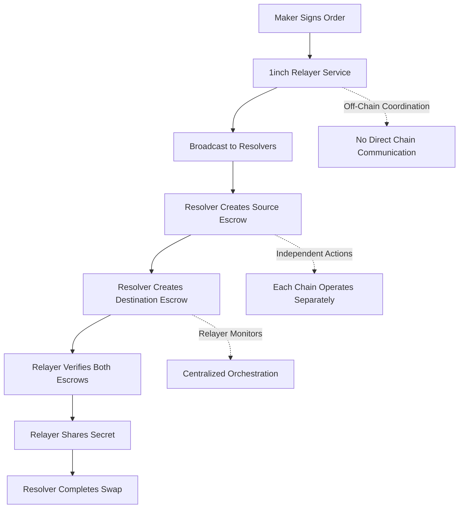

## 🔗 **5. Cross-Chain Coordination (Off-Chain)**

> **Purpose**: Handles communication between ICP and EVM chains via off-chain relayer
> **Reference**: [Fusion+ Whitepaper](1inch-fusion-plus-whitepaper.md) - Phase 2 & 3

> **📋 Key Finding**: According to the Fusion+ whitepaper, cross-chain coordination happens **OFF-CHAIN** through the 1inch relayer service, not through on-chain bridges or direct chain communication.

### **Whitepaper Flow Analysis**



### **Off-Chain Coordination Pattern**

```javascript
// Based on: docs/1inch-fusion-plus-whitepaper.md (lines 92-106)
// Cross-chain coordination happens through the relayer service, NOT on-chain

class CrossChainCoordinator {
  constructor() {
    this.relayer = new FusionPlusRelayer();
  }

  // Phase 2: Deposit Phase (Independent Chain Operations)
  async coordinateEscrowCreation(orderHash, order) {
    // STEP 1: Resolver creates source escrow (ICP)
    const srcEscrow = await this.createSourceEscrow(order);

    // STEP 2: Resolver creates destination escrow (Ethereum)
    const dstEscrow = await this.createDestinationEscrow(order);

    // STEP 3: Relayer monitors both escrows (OFF-CHAIN)
    await this.relayer.notifyEscrowCreated(orderHash, srcEscrow, "SOURCE");
    await this.relayer.notifyEscrowCreated(orderHash, dstEscrow, "DESTINATION");

    // STEP 4: Relayer waits for finality (OFF-CHAIN)
    // No on-chain communication needed!
  }

  // Phase 3: Withdrawal Phase (Independent Chain Operations)
  async coordinateSecretRevelation(orderHash) {
    // STEP 1: Relayer shares secret (OFF-CHAIN)
    await this.relayer.revealSecretIfReady(orderHash);

    // STEP 2: Resolver withdraws from source chain (ICP)
    await this.withdrawFromSourceChain(orderHash, secret);

    // STEP 3: Resolver withdraws from destination chain (Ethereum)
    await this.withdrawFromDestinationChain(orderHash, secret);

    // No cross-chain on-chain communication!
  }

  // Key Insight: Each chain operates independently
  async createSourceEscrow(order) {
    // ICP canister call - no cross-chain communication
    return await this.icpClient.callCanister(this.escrowFactoryCanister, "create_escrow_src", [order]);
  }

  async createDestinationEscrow(order) {
    // Ethereum contract call - no cross-chain communication
    return await this.evmClient.sendTransaction(order.chainIdDst, this.escrowFactoryAddress, this.encodeCreateEscrowData(order));
  }
}
```

### **Why Off-Chain Coordination?**

**1. Security Benefits:**

- ✅ **No Bridge Vulnerabilities**: No cross-chain bridges to hack
- ✅ **No Chain Reorganization Issues**: Each chain operates independently
- ✅ **Simplified Architecture**: Relayer handles coordination complexity

**2. Performance Benefits:**

- ✅ **Faster Execution**: No waiting for cross-chain confirmations
- ✅ **Lower Gas Costs**: No bridge transaction fees
- ✅ **Better Reliability**: No bridge downtime issues

**3. Architectural Benefits:**

- ✅ **Chain Independence**: Each chain can have different finality times
- ✅ **Flexible Monitoring**: Relayer can adapt to chain-specific requirements
- ✅ **Easy Integration**: Works with any chain combination

### **Implementation for ICP ↔ EVM**

```javascript
// src/lib/cross-chain-coordinator.js
export class CrossChainCoordinator {
  constructor() {
    this.icpClient = new ICPClient();
    this.evmClient = new EVMClient();
    this.relayer = new FusionPlusRelayer();
  }

  // The coordination happens through the relayer, not direct chain communication
  async executeFusionPlusSwap(order, signature, secret) {
    try {
      // Phase 1: Announce (already done)
      const orderHash = await this.relayer.announceOrder(order, signature, secret);

      // Phase 2: Create escrows independently
      const srcEscrow = await this.createICPEscrow(order);
      const dstEscrow = await this.createEVMEscrow(order);

      // Phase 3: Relayer coordinates (off-chain)
      await this.relayer.notifyEscrowCreated(orderHash, srcEscrow, "SOURCE");
      await this.relayer.notifyEscrowCreated(orderHash, dstEscrow, "DESTINATION");

      // Phase 4: Secret revelation (off-chain)
      await this.relayer.revealSecretIfReady(orderHash);

      // Phase 5: Independent withdrawals
      await this.withdrawFromICP(srcEscrow, secret);
      await this.withdrawFromEVM(dstEscrow, secret);

      return { success: true };
    } catch (error) {
      console.error("Error in cross-chain coordination:", error);
      throw error;
    }
  }

  // Each chain operates independently - no cross-chain communication needed
  async createICPEscrow(order) {
    // Pure ICP canister call
    return await this.icpClient.callCanister(process.env.ICP_ESCROW_FACTORY, "create_escrow_src", [order]);
  }

  async createEVMEscrow(order) {
    // Pure EVM transaction
    return await this.evmClient.sendTransaction(order.chainIdDst, process.env.EVM_ESCROW_FACTORY, this.encodeCreateEscrowData(order));
  }
}
```

### **Key Takeaway**

> **Cross-chain coordination in Fusion+ is OFF-CHAIN through the relayer service, not ON-CHAIN through bridges or direct chain communication. Each chain operates independently, and the relayer orchestrates the process.**

This approach eliminates the need for:

- ❌ Cross-chain bridges
- ❌ On-chain message passing
- ❌ Chain-specific finality coordination
- ❌ Bridge security vulnerabilities

Instead, it relies on:

- ✅ Independent chain operations
- ✅ Off-chain relayer coordination
- ✅ Cryptographic secrets for atomicity
- ✅ Economic incentives for completion

---
