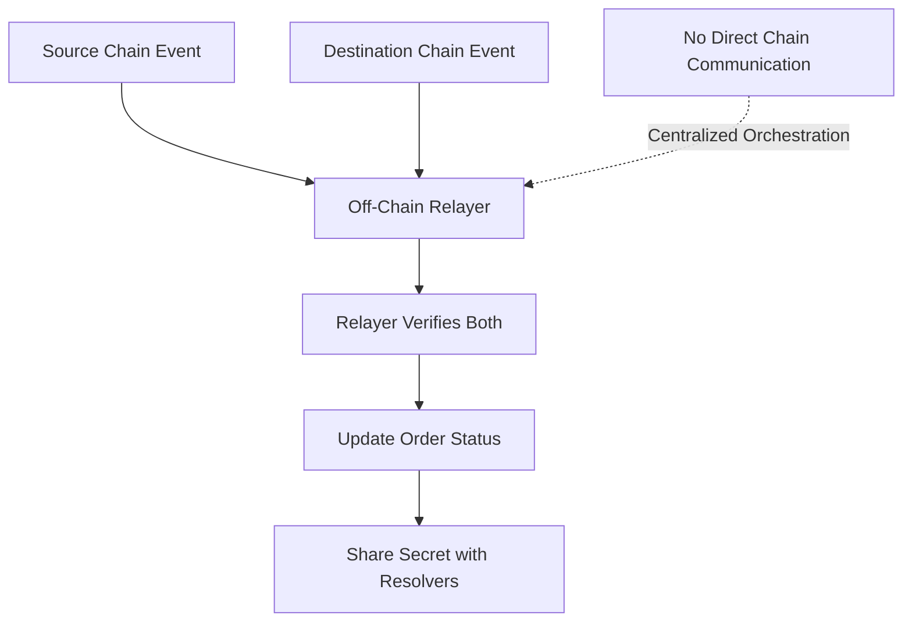

# Relayer Asset Locking Monitoring

> **Purpose**: Explains how the relayer service monitors and verifies that assets are locked on both sides of a cross-chain swap
> **Reference**: Based on analysis of the cross-chain-swap repository and Fusion+ protocol

## Overview

In the 1inch Fusion protocol, the relayer service plays a crucial role in monitoring cross-chain asset locking. Unlike traditional bridges that use on-chain communication, Fusion uses **off-chain relayer coordination** with **smart contract events** as the primary mechanism for tracking asset states across chains.

## Key Finding: Off-Chain Coordination

> **📋 Important**: Cross-chain coordination in Fusion happens **OFF-CHAIN** through the relayer service, not through on-chain bridges or direct chain communication.



## Smart Contract Events (Primary Method)

### Event Definitions

The relayer monitors specific blockchain events emitted by the smart contracts:

```solidity
// From contracts/interfaces/IEscrowFactory.sol
event SrcEscrowCreated(IBaseEscrow.Immutables srcImmutables, DstImmutablesComplement dstImmutablesComplement);
event DstEscrowCreated(address escrow, bytes32 hashlock, Address taker);
```

### Event Signatures

The codebase defines specific event signatures for reliable parsing:

```solidity
// From examples/script/utils/EscrowDevOpsTools.sol
bytes32 public constant SRC_ESCROW_CREATED_EVENT_SIGNATURE = 0x0e534c62f0afd2fa0f0fa71198e8aa2d549f24daf2bb47de0d5486c7ce9288ca;
bytes32 public constant DST_ESCROW_CREATED_EVENT_SIGNATURE = 0xc30e111dcc74fddc2c3a4d98ffb97adec4485c0a687946bf5b22c2a99c7ff96d;
```

## Asset Locking Flow

### Step 1: Source Escrow Creation

When a resolver executes a maker's signed order:

```solidity
// From contracts/BaseEscrowFactory.sol
function _postInteraction(...) internal override {
    // 1. Verify maker's signature
    // 2. Compute escrow address deterministically
    // 3. Transfer maker's tokens to escrow
    // 4. Create source escrow with tokens inside

    emit SrcEscrowCreated(immutables, immutablesComplement);

    // 5. Deploy escrow contract
    address escrow = _deployEscrow(salt, 0, ESCROW_SRC_IMPLEMENTATION);

    // 6. Verify sufficient balance
    if (escrow.balance < immutables.safetyDeposit ||
        IERC20(order.makerAsset.get()).safeBalanceOf(escrow) < makingAmount) {
        revert InsufficientEscrowBalance();
    }
}
```

### Step 2: Destination Escrow Creation

The resolver then creates the destination escrow:

```solidity
// From contracts/BaseEscrowFactory.sol
function createDstEscrow(IBaseEscrow.Immutables calldata dstImmutables, uint256 srcCancellationTimestamp) external payable {
    // 1. Validate timelocks
    // 2. Deploy destination escrow
    address escrow = _deployEscrow(salt, msg.value, ESCROW_DST_IMPLEMENTATION);

    // 3. Transfer destination tokens to escrow
    if (token != address(0)) {
        IERC20(token).safeTransferFrom(msg.sender, escrow, immutables.amount);
    }

    // 4. Emit creation event
    emit DstEscrowCreated(escrow, dstImmutables.hashlock, dstImmutables.taker);
}
```

### Step 3: Relayer Event Monitoring

The relayer monitors both events and updates order status:

```javascript
// From docs/icp-fusion-plus-implementation-02-relayer.md
class FusionPlusRelayer {
  async monitorEscrows(orderHash) {
    const srcEscrow = await this.verifySrcEscrow(orderHash);
    const dstEscrow = await this.verifyDstEscrow(orderHash);

    if (srcEscrow && dstEscrow) {
      this.orders.get(orderHash).status = "escrows_created";
      await this.startFinalityTimer(orderHash);
    }
  }

  async notifyEscrowCreated(orderHash, escrowCanister, escrowType) {
    const orderState = this.orders.get(orderHash);

    if (escrowType === "SOURCE") {
      orderState.srcEscrow = escrowCanister;
    } else if (escrowType === "DESTINATION") {
      orderState.dstEscrow = escrowCanister;
    }

    // Check if both escrows are created
    if (orderState.srcEscrow && orderState.dstEscrow) {
      orderState.status = "ESCROWS_CREATED";

      // Start finality lock timer (Fusion+ enhancement)
      const finalityDelay = 600000; // 10 minutes
      orderState.finalityTimer = Date.now() + finalityDelay;

      console.log(`Both escrows created for order ${orderHash}`);
    }
  }
}
```

## Event Verification Process

### Event Parsing Utilities

The codebase includes utilities for parsing escrow creation events:

```solidity
// From examples/script/utils/EscrowDevOpsTools.sol
function getOrderHashAndTimelocksFromSrcEscrowCreatedEvent(Config memory config)
    internal view returns(bytes32 orderHash, Timelocks) {
    DevOpsTools.Receipt memory receipt = DevOpsTools.getMostRecentLog(
        config.escrowFactory,
        SRC_ESCROW_CREATED_EVENT_SIGNATURE,
        block.chainid,
        RELATIVE_BROADCAST_PATH
    );

    if (receipt.data.length < 256) {
        revert NoSrcEscrowCreatedEventFound();
    }

    return (toBytes32(receipt.data, 0), Timelocks.wrap(uint256(toBytes32(receipt.data, 224))));
}

function getEscrowDstAddressAndDeployTimeFromDstEscrowCreatedEvent(Config memory config)
    internal view returns(address, uint256) {
    DevOpsTools.Receipt memory receipt = DevOpsTools.getMostRecentLog(
        config.escrowFactory,
        DST_ESCROW_CREATED_EVENT_SIGNATURE,
        block.chainid,
        RELATIVE_BROADCAST_PATH
    );

    if (receipt.data.length < 96) {
        revert NoDstEscrowCreatedEventFound();
    }

    return (address(uint160(uint256(toBytes32(receipt.data, 0)))), receipt.timestamp);
}
```

### Verification Steps

1. **Event Detection**: Relayer monitors blockchain for specific event signatures
2. **Data Parsing**: Extract escrow addresses, amounts, and timelocks from event data
3. **Balance Verification**: Confirm tokens are actually transferred to escrow contracts
4. **Status Update**: Mark order as "ESCROWS_CREATED" when both events are detected
5. **Finality Timer**: Start countdown for Fusion+ finality lock mechanism

## Cross-Chain Communication Pattern

### No Direct Chain Communication

Unlike traditional bridges, Fusion does **NOT** use:

- ❌ On-chain bridges
- ❌ Direct chain-to-chain communication
- ❌ Cross-chain message passing
- ❌ Shared state between chains

### Off-Chain Relayer Coordination

Instead, Fusion uses:

- ✅ **Off-chain relayer service** as central coordinator
- ✅ **Smart contract events** for state verification
- ✅ **Independent chain operations** with relayer orchestration
- ✅ **Event monitoring** for cross-chain state synchronization

## Relayer Monitoring Architecture

### Event Monitoring Service

```javascript
class EscrowMonitor {
  constructor(web3Providers) {
    this.ethProvider = web3Providers.ethereum;
    this.polygonProvider = web3Providers.polygon;
    this.eventCache = new Map();
  }

  async startMonitoring() {
    // Monitor source chain events
    this.ethProvider.on("log", (log) => {
      if (log.topics[0] === SRC_ESCROW_CREATED_EVENT_SIGNATURE) {
        this.handleSrcEscrowCreated(log);
      }
    });

    // Monitor destination chain events
    this.polygonProvider.on("log", (log) => {
      if (log.topics[0] === DST_ESCROW_CREATED_EVENT_SIGNATURE) {
        this.handleDstEscrowCreated(log);
      }
    });
  }

  async handleSrcEscrowCreated(log) {
    const orderHash = this.parseOrderHash(log.data);
    const escrowAddress = this.parseEscrowAddress(log.data);

    await this.relayer.notifyEscrowCreated(orderHash, escrowAddress, "SOURCE");
  }

  async handleDstEscrowCreated(log) {
    const escrowAddress = this.parseEscrowAddress(log.data);
    const hashlock = this.parseHashlock(log.data);

    await this.relayer.notifyEscrowCreated(orderHash, escrowAddress, "DESTINATION");
  }
}
```

### Order State Management

```javascript
class OrderStateManager {
  constructor() {
    this.orders = new Map();
  }

  updateOrderStatus(orderHash, status) {
    const order = this.orders.get(orderHash);
    if (order) {
      order.status = status;
      order.lastUpdated = Date.now();

      // Trigger next phase based on status
      switch (status) {
        case "ESCROWS_CREATED":
          this.startFinalityTimer(orderHash);
          break;
        case "FINALITY_PASSED":
          this.revealSecret(orderHash);
          break;
      }
    }
  }

  async startFinalityTimer(orderHash) {
    const finalityDelay = 600000; // 10 minutes

    setTimeout(() => {
      this.updateOrderStatus(orderHash, "FINALITY_PASSED");
    }, finalityDelay);
  }
}
```

## Error Handling and Recovery

### Event Monitoring Failures

**Scenario**: What if events are missed or delayed?

**Solutions**:

```javascript
class RobustEventMonitor {
  async verifyEscrowCreation(orderHash) {
    // 1. Try event-based verification
    const eventData = await this.getEscrowEvents(orderHash);

    if (eventData) {
      return eventData;
    }

    // 2. Fallback to direct contract calls
    const escrowAddress = await this.computeEscrowAddress(orderHash);
    const balance = await this.getEscrowBalance(escrowAddress);

    if (balance > 0) {
      return { address: escrowAddress, balance };
    }

    // 3. Manual verification as last resort
    throw new Error("Escrow verification failed");
  }
}
```

### Cross-Chain Consistency

**Scenario**: What if one chain confirms but the other doesn't?

**Solutions**:

```javascript
class CrossChainConsistency {
  async ensureBothEscrowsCreated(orderHash) {
    const srcEscrow = await this.verifySrcEscrow(orderHash);
    const dstEscrow = await this.verifyDstEscrow(orderHash);

    if (srcEscrow && !dstEscrow) {
      // Source created but destination failed
      await this.handlePartialCreation(orderHash, "SOURCE_ONLY");
    } else if (!srcEscrow && dstEscrow) {
      // Destination created but source failed
      await this.handlePartialCreation(orderHash, "DESTINATION_ONLY");
    } else if (srcEscrow && dstEscrow) {
      // Both created successfully
      await this.proceedWithSwap(orderHash);
    }
  }
}
```

## Security Considerations

### Event Verification Security

1. **Signature Validation**: Verify event signatures match expected patterns
2. **Data Integrity**: Validate event data against expected order parameters
3. **Replay Protection**: Ensure events are not processed multiple times
4. **Timelock Validation**: Verify escrow timelocks are within acceptable ranges

### Relayer Security

1. **Access Control**: Only authorized relayers can update order states
2. **Rate Limiting**: Prevent spam of escrow creation events
3. **Monitoring**: Comprehensive logging of all event processing
4. **Fallback Mechanisms**: Manual override capabilities for stuck orders

## Implementation for ICP Integration

### ICP-Specific Considerations

For ICP ↔ ETH swaps, the monitoring pattern remains similar:

```rust
// ICP canister monitoring ETH events
#[update]
async fn monitor_eth_escrow_creation(order_hash: String) -> Result<EscrowStatus, Error> {
    // 1. Use HTTP outcalls to query ETH node
    let eth_provider = "https://eth-mainnet.alchemyapi.io/v2/...";
    let response = http_outcall::call(eth_provider, &format!("/api/v1/logs?address={}&topic0={}",
        ESCROW_FACTORY_ADDRESS, DST_ESCROW_CREATED_EVENT_SIGNATURE)).await?;

    // 2. Parse event data
    let event_data = parse_escrow_created_event(&response.body)?;

    // 3. Verify escrow was created for this order
    if event_data.order_hash == order_hash {
        Ok(EscrowStatus::Created {
            address: event_data.escrow_address,
            amount: event_data.amount,
        })
    } else {
        Ok(EscrowStatus::NotFound)
    }
}
```

### Manual Verification (Mechanical Turk)

For the PoC implementation, manual verification can be used:

```typescript
// Manual relayer verification for PoC
class MechanicalTurkRelayer {
  async verifyBothEscrows(orderId: string): Promise<boolean> {
    // 1. Manual check: ICP escrow has funds
    const icpEscrow = await this.checkICPEscrow(orderId);

    // 2. Manual check: ETH escrow has funds
    const ethEscrow = await this.checkETHEscrow(orderId);

    // 3. Human verification
    const humanVerified = await this.showVerificationUI({
      icpEscrow,
      ethEscrow,
      orderId,
    });

    return humanVerified;
  }
}
```

## Summary

### How the Relayer Knows Assets Are Locked:

1. **Smart Contract Events**: Primary mechanism for asset locking verification
2. **Off-Chain Monitoring**: Relayer service monitors events via Web3 providers
3. **Event Parsing**: Relayer extracts escrow addresses, amounts, and parameters
4. **Status Updates**: Order status updated when both events are detected
5. **Cross-Chain Coordination**: All coordination happens off-chain through relayer

### Key Technical Points:

- ✅ **Events are the primary mechanism** for asset locking verification
- ✅ **Off-chain relayer** monitors both chains independently
- ✅ **No direct chain-to-chain communication** - everything goes through relayer
- ✅ **Event signatures** are predefined for reliable parsing
- ✅ **Manual verification** is also possible for debugging/testing

This pattern allows the relayer to maintain a centralized view of the cross-chain swap state while the actual asset locking happens independently on each chain.
