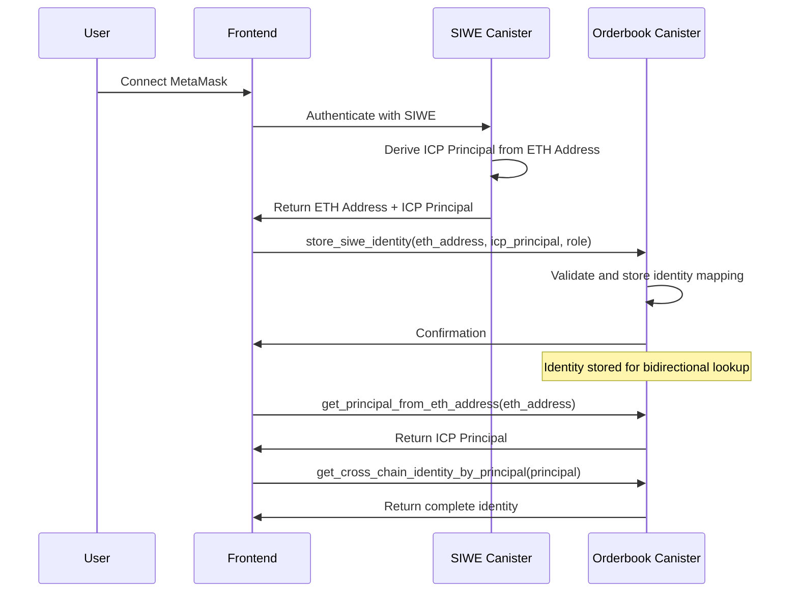

# SIWE Integration Approach Update

## 📋 **Overview**

Updated the orderbook canister's cross-chain identity management approach to simplify integration with SIWE (Sign-In with Ethereum). Instead of the orderbook canister performing complex cryptographic derivation of ICP principals from Ethereum addresses, the frontend and SIWE canister handle this process and provide both identities to the orderbook for storage.

## 🔄 **Changes Made**

### 1. **Requirements Updated**

**File:** `.kiro/specs/orderbook_canister_fusion+/requirements.md`

**Requirement 5** changed from:

- ❌ "Automatic Cross-Chain Identity Management" with complex derivation
- ✅ "Cross-Chain Identity Storage and Management" with simple storage

**Key Changes:**

- Frontend provides both ETH address and ICP principal
- SIWE authentication completed by frontend
- Orderbook stores and manages identity mappings
- Bidirectional lookup services maintained

### 2. **Design Document Updated**

**File:** `.kiro/specs/orderbook_canister_fusion+/design.md`

**Added New Section:** "Cross-Chain Identity Management"

- Documents the simplified identity flow
- Explains separation of concerns between components
- Lists benefits of the new approach

**Updated Component Descriptions:**

- Orderbook: "Identity Storage" instead of "Identity Management"
- Frontend: "SIWE Authentication and principal derivation"

### 3. **Task 5 Updated**

**File:** `.kiro/specs/orderbook_canister_fusion+/tasks.md`

**Task 5** changed from:

- ❌ Complex identity derivation and SIWE integration
- ✅ Simple identity storage and validation

**New Focus:**

- Accept both ETH address and ICP principal from frontend
- Remove complex derivation logic
- Add validation for received identity pairs
- Maintain bidirectional lookup functions

### 4. **Implementation Updated**

**File:** `src/orderbook/src/lib.rs`

#### Enhanced Functions:

**`register_cross_chain_identity()`:**

- Now accepts `eth_address`, `icp_principal`, and `role` parameters
- Validates ETH address format
- Stores the complete identity mapping

**`get_principal_from_eth_address()`:**

- Simplified query function
- Returns stored principal for given ETH address

**`store_siwe_identity()`:**

- Clear naming for SIWE flow
- Delegates to main registration function

#### Removed Complexity:

- ❌ Complex SIWE provider canister calls
- ❌ Cryptographic principal derivation
- ❌ External canister dependencies for identity

## 🎯 **Benefits of New Approach**

### 1. **Simplified Orderbook**

- No complex cryptographic operations
- Reduced external dependencies
- Faster and more reliable identity operations

### 2. **Better Separation of Concerns**

- **Frontend/SIWE Canister**: Handles authentication and derivation
- **Orderbook Canister**: Handles storage and lookup
- **Clear Responsibilities**: Each component has a focused role

### 3. **Improved Reliability**

- Leverages proven SIWE implementation
- Reduces potential points of failure
- Simpler error handling

### 4. **Enhanced Performance**

- Fast identity lookups without derivation
- No external canister calls for identity operations
- Reduced latency for identity-related functions

## 🔄 **Integration Approach**

### For All Integrations:

- ✅ **Main Function**: Use `register_cross_chain_identity()` with both identities
- ✅ **SIWE Flow**: Use `store_siwe_identity()` for clear SIWE integration
- ✅ **Validation**: Built-in ETH address format validation

## 📊 **Identity Flow**

## ✅ **Validation**

The updated implementation:

- ✅ **Compiles Successfully**: All changes compile without errors
- ✅ **Simplified Implementation**: No legacy compatibility needed
- ✅ **Simplifies Integration**: Clearer SIWE integration pattern
- ✅ **Improves Performance**: Faster identity operations
- ✅ **Reduces Complexity**: Removed complex derivation logic

## 🚀 **Next Steps**

1. **Task 5 Implementation**: Use the simplified approach for identity management
2. **Frontend Integration**: Update frontend to use new identity functions
3. **Testing**: Create comprehensive tests for the new identity flow
4. **Documentation**: Update API documentation with new function signatures

This update significantly simplifies the SIWE integration while maintaining all required functionality and improving the overall system architecture.
